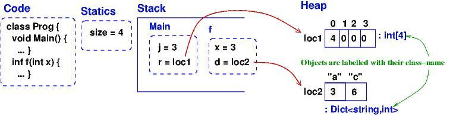
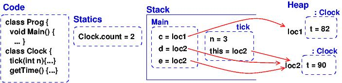
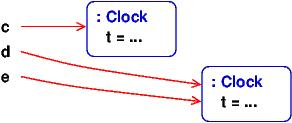
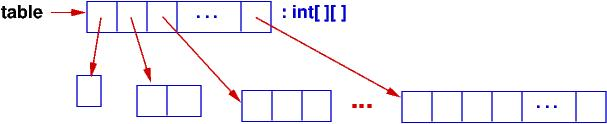

.. raw:: html

    
   
   <big><big><b>
   
Course Notes --- CIS 501: Software Architecture and Design, Fall 2014

.. raw:: html

   </b></big></big>
   

.. _storage-object-diagrams:

Storage Diagrams and Object Diagrams
####################################

You can't be a good programmer if you do not understand how data structures are
laid out in storage.
Here is a short quiz: What is allocated in storage by these declarations?

* ``int x = 3`` (a fullword named ``x`` is allocated to hold integer ``3``.)

* ``int[] r = new int[5]`` (a sequence of five fullwords is allocated for the 
  array, and the addresss --- handle --- of the array is stored in a fullword
  named ``r``)
  
* This example is from C:

  .. code-block:: c
  
     struct BankAccount {  // template for allocating a "frame" (namespace) of vars
       int acct_number;
       char[50] *name;
       float balance;
     };
     BankAccount s;   // allocates a frame and names it  s
     s.acct_number = 999;

  A sequence of fullwords, large enough to hold an int, fifty chars, and a float,
  is allocated and the handle of the sequence is saved in a fullword named ``s``.
  The sequence of fullwords is indexed by ``acct_number``, ``name``, and ``balance``.
  Call this a *frame*.

* This example is from C#:

  .. code-block:: c#
  
     class BankAccount {  // template for allocating a frame/namespace of vars
                          // and for associating methods to compute on the frame
       public readonly int acct_number;
       public readonly string name;
       private float balance;

       public BankAccount(int num, string n) { acct_number = num;  name = n; }
       public void deposit(float m) { if (m>0){ balance = balance + m; } }
       public float getBalance() { return balance; }
     }

     class Program {
       static BankAccount master_acct = new BankAccount(000, "Bank");

       public static void Main() {
         BankAccount customer = new BankAccount(999, "Edward");  // allocates and names object
         // ...
       }
     }
     
  Two sequences are allocated.
  Each sequence is large enough to hold an int, a (handle to a) string, and a
  float.
  The handles to the sequences are saved in fullwords named ``master_acct``
  and ``customer``.
     
The last two explanations are not terribly precise, so we learn to draw
storage diagrams and object diagrams to make the explanations better.
   
A ``struct`` in C is a template for allocating a frame.
A *class* in C++/Java/C# is a template for allocating a frame *and*
defining functions (*methods*) that access the frame.

An *object* is the frame that is allocated when you construct a new instance of
a class template.
A *static* variable or method is a single instance that is "pre-declared"
(and not constructed while the program executes).

Storage Layout
**************

A von Neumann-style computer uses linear primary storage.
When you start a computer and then start, say, a web browser, storage looks
somewhat like this::

    +-----------------------+------------------+------------------------+
    | operating system code | web browser code | ... ( free space ) ... |
    +-----------------------+------------------+------------------------+

Say you start a C# program, which is an ``.exe`` file.
Some of the free space is used: The program (``.exe`` file) itself is loaded and
there is space reserved for a "static area", a "stack", and a "heap".
The layout looks like this::

    +-- ... --+------------+-------------+----------------------------+------------------------------------------+
    | OS etc. | C# program | static area | stack --> (empty) <-- heap | ...(remaining free space)...             |
    +-- ... --+------------+-------------+----------------------------+------------------------------------------+

The code and static vars are copied into fixed segments.
The stack and heap both grow while the program executes, so they are laid out at
opposite ends of the allocated segment.
(If they grow together, the OS is asked to allocate more storage for the program
--- we won't worry about this!)

When a new object is allocated, its frame is allocated in the heap part.

When a method is called, its parameter-argument bindings and its local variables
are saved in a new frame that is allocated "on top of" the stack.
(When the method finishes, the frame is "popped" from the stack.)

So, *a frame and an object are the same thing in computer storage*, but
they are allocated at different places.
(The reason they look the same is due to a lot of pre-computation,
embedded in the ``.exe`` file, done by the C# compiler.)

Storage diagram: Example with static vars, an array, and a dictionary
=====================================================================

Let's study the storage layout for this example, when the execution reaches ``//***``:

.. code-block:: c#

   using System;
   using System.Collections.Generic;
   using System.Linq;
   using System.Text;

   namespace Storage_Object_Diagrams_1 {
   
     // example that shows static variable and two objects
     class Program {

       public static int size = 4;

       public static void Main() {
         int[] r = new int[size];
         r[0] = size;
         int j = size - 1;
         r[j] = f(j);
       }

       public static int f(int x) {
         // this dictionary is a kind of array, indexed by strings, that can grow:
         Dictionary<string, int> d = new Dictionary<string, int>();
         d["a"] = x;
         d["c"] = d["a"] + x;
         //***  insert breakpoint at the front of the next line:
         return size + x;
       }
     }
   }

Here's the *storage diagram*, which shows the layout of this program's memory
partition. (This is drawn in "sort-of linear layout".)
   

   
Data structures likes arrays and dictionaries are allocated in the heap.
(Note: I drew the dictionary as a kind-of array, but most languages implement
a dictionary as a hash table.)
Frames for method/procedure/function calls are saved on the stack.
When a method completes, its frame is "popped" (erased).
A frame in the heap is never popped (but if the frame is no longer used by
the program, a garbage collector program, running in background,
erases the frame).

Now, run VS on the example and break at point ``//***`` to see how VS presents
the storage layout in its Debug windows; compare it to the storage diagram --- 
you will see VS is not so good at displaying static variables.
Also, it displays the dictionary as a complicated array
(it's really a hash table!).
Also, VS does not show that the array and the dictionary are saved in the heap.

Storage diagram: Example with user-defined class
************************************************

Run this example, and stop it when the execution reaches ``//***``:

.. code-block:: c#

   using System;
   using System.Collections.Generic;
   using System.Linq;
   using System.Text;

   namespace Storage_Object_Diagrams_2 {

     class Program {
       // example that shows two objects that share a static field
       static void Main() {
         Clock c = new Clock(80);
         Clock d = new Clock(90);
         c.tick(2);
         Clock e = d;
         d.tick(3);
         Console.WriteLine(e.getTime());
         Console.ReadLine();   //*** insert break point at beginning of this line   
       }
     }

     class Clock {
       static int count = 0;
       private int t = 0;

       public Clock(int start) {
         t = start;
         count = count + 1;
       }

       public void tick(int n) {
         //*** insert break point at beginning of next line:
         t = t + n;
       }

       public int getTime() { return t; }
     }
   }
  
When the breakpoint is reached the second time, due to the call, ``d.tick(3)``, 
here is the storage diagram:
  

  
*The methods for the two Clocks are saved in the Code area, and not in the 
objects (frames)*.
Doing the latter would be correct but a waste of storage.
This little optimization causes a serious complication --- see below.

Now, run VS on the example and break at point ``//***`` to see how VS presents
the storage layout.
Match it to the above diagram.

Visual Studio is not good at showing the handles (addresses) of objects, and
VS does *not* show the difference between the stack and the heap, and
it does not show that ``c`` and ``e`` hold the same handle to
(that is, they *alias*)
the same object, which is can be bad! Be careful!

Now, consider the code in tick:

.. code-block:: c#

   public void tick(int n) {
     t = t + n ;
   }

Variable ``n`` is local and saved in ``tick``'s frame.
But ``t`` is nowhere to be seen.
*To find it, ``this`` is used: ``t`` is read as ``this.t``*, which locates the
correct variable.
The value of ``this`` was set in ``tick``'s frame by the call, ``d.tick(3);``.

*The handle saved in variable ``d`` becomes the value of variable ``this``.* 
Indeed, the C# compiler reformats ``d.tick(3)`` into this call, 
``tick(d, 3)``, which calls this reformatted definition:

.. code-block:: c#

   public void tick(Clock this, int n) {
     this.t = this.t + n;
   }

*The C# compiler does this reformatting to all definitions and all calls of
non-static (class) methods.*

This setup lets the code for ``tick``, saved in the Code Area, work correctly
with all of object ``c`` and ``d`` (and ``e``).

Object Diagrams
===============

A well-written program will allocate its objects in a pattern ("topology") in
the heap.
The pattern is important to understanding what the program does.
Say that a program is started and is in the middle of its execution.
A picture showing just its heap (no code, statics, stack, and breakpoints), is
called an object diagram.

The object diagrams for the two previous examples are really simple!
Here is the second example's object diagram:

Real programs have interesting object diagrams.
Here is an example: This code allocates and uses a table that is a ragged array:

.. code-block:: c#

   public static void Main() {
     int size = Int32.Parse(Console.ReadLine("Type size:"));
     int[][] table = new int[size][];
     for(int i = 0; i != table.Length; i++) {
       table[i] = new int[i+1]; 
     }
     // ... compute on table ...
   }  

Once the program starts and allocates its objects, the object diagram looks like
this:

The diagram displays the pattern of data structure maintained by the program.

An object diagram is used by a programmer to explain to others what the program
"builds" in storage.
It is a standard form of documentation that accompanies a system.
You will use object diagrams a lot when you design, implement, test, and explain
complex systems.

Object Serialization/Deserialization
************************************

Many tools for object-oriented programming languages like C# exist that provide
object serialization/deserialization in a textual form.
The tools aim to provide the ability to "persist" object states across app
sessions.
That is, one can "save" the object state by *serializing* the object and all
objects reachable from it (i.e., by following the arrows in the object diagram),
as a string and then write it to a file; the object can later then be "restored"
by *deserializing* the string stored in the file.
It just so happen that the typical textual form used by these tools is actually
a textual encoding of the object diagram.

One such tool that we will use here is 
`Json.NET <http://http://james.newtonking.com/json>`__.
For example, for the ``Clock`` example in the ``Storage_Object_Diagrams_2`` 
above, we serialize the objects stored in ``c``, ``d``, and ``e`` of the 
``Program``'s ``Main`` method as follows:

.. code-block:: c#

   static void Main() {
     Clock c = new Clock(80);
     Clock d = new Clock(90);
     c.tick(2);
     Clock e = d;
     d.tick(3);
     Console.WriteLine(e.getTime());
            
     // serializes values of c, d, and e as mString
     Dictionary<string, Object> m = new Dictionary<string, Object>();
     m["c"] = c;
     m["d"] = d;
     m["e"] = e;
     JsonSerializerSettings settings = new JsonSerializerSettings {
       ContractResolver = new CustomJsonContractResolver(),
       PreserveReferencesHandling = PreserveReferencesHandling.Objects
     };
     string mString = JsonConvert.SerializeObject(m, Formatting.Indented, settings);
     Console.WriteLine(mString);
     
     // ...
   }

The important part is the call to ``JsonConvert.SerializeObject`` that can
serialize any .Net object (of any type) into a string in the form of
Javascript Object Notation (JSON). JSON format is simply a (possibly-nested)
dictionary object format consisting of keys and values: 
``{`` key1 ``:`` value1 ``,`` ... ``,`` keyN ``:`` valueN ``}``
where the keys are field names (or array indices) and the values are the 
corresponding values of the fields (or the array elements).

For the example above, the content of ``mString`` is as follows.

.. code-block:: json

   {
     "$id": "1",
     "c": {
       "$id": "2",
       "t": 82
     },
     "d": {
       "$id": "3",
       "t": 93
     },
     "e": {
       "$ref": "3"
     }
   }
   
As can be observed, for each object, Json.NET assigns an object handle with
mapped to the key ``$id``. The first JSON object with ``$id`` equal to ``"1"`` 
is the object pointed to by ``m``, which is a ``Dictionary<string, Object>``.
Object ``m`` contains the values of ``c``, ``d``, and ``e`` (which are mapped by
keys ``"c"``, ``"d"``, and ``"e"``, respectively). Notice that the JSON object
``"e"`` contains a reference to ``"3"`` (indicated by the key ``"$ref"``).
This indicates that the object has been serialized before (i.e., in ``"d"``);
thus, we can see that ``"d"`` and ``"e"`` (hence ``d`` and ``e``) are actually 
pointing to the same object (alias), which we do not see in the VS debugger.

To deserialize the object back from ``mString``, one can use 
``JsonConvert.DeserializeObject`` as follows:

.. code-block:: c#

   Dictionary<string, Object> m2 = JsonConvert.DeserializeObject<Dictionary<string, Object>>(mString, settings);
   
When ``m2`` is serialized, the resulting string is equal to ``mString``!

Object Diagrams for Design
**************************

Object diagrams are especially useful when we design large systems, because
they are a kind of "blueprint" of how computer storage will be organized.

When an object diagram is used for design, only the heap is drawn and details
about fields within the objects are optional.
Class names are usually attached to the objects.

Here is an example:
We plan to build a database of bank accounts and customers, where a customer
might own multiple bank accounts.
Access to the accounts is made through two "manager" objects, which enforce
the rules for "checking out", using, and "checking in" the accounts.
The data base also has a global clock and an "administrator" object.
Here is a design object diagram that shows how the heap might look once
the system is executing:

.. image:: ob.jpg

The arrows are pointers (handles) held in objects that connect to other objects.
List/Dictionary/Array-like collections are drawn as vectors.
Objects are labelled, ``:CLASSNAME``, since we will be coding classes to
generate the objects.
It is optional to list the fields that are held in the objects.
(Do this if it helps you better understand the design.)

The example shows how there is exactly one clock in the system;
there are two databases, one holding customers and one holding accounts.
A customer can own handles/pointers to zero or more accounts.
Each account must be owned/pointed-to by exactly one customer.

An object diagram like this can be shown to the other engineers on the project
and even the bank manager, so that everyone understands what must be built.

Another example: we are designing a card game that uses Cards, a Deck to
hold the cards, and a Hand-of-Cards for each Player.
Here is a design expressed as an object diagram:

.. image:: ob2.jpg

The design shows that each Player object holds (some methods) and a handle to a 
HandOfCards object, which itself holds (some methods) and a handle to a vector
of (handles to) Card objects. There is only one DeckOfCards object, which holds
(some methods) and a handle to a vector that holds (handles to) Card objects.
Clearly, each Card object is "owned" by at most one vector at a time ---
no sharing.
When you code this system, you compare the storage layouts generated by the 
execution to the object diagram.

There is more to say about this next time.

----

.. raw:: html

   
<small><em>
   This note was adapted from David Schmidt's CIS 501, Spring 2014, 
   <a href="http://people.cis.ksu.edu/~schmidt/501s14/Lectures/Lecture03S.html">Lecture 3</a>
   course note. © Copyright 2014, David Schmidt.
   </em></small>

    