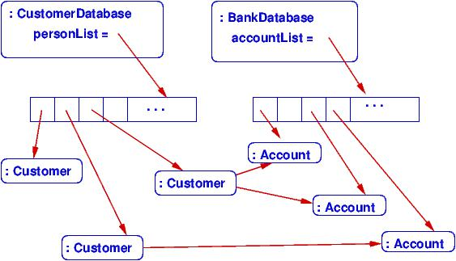
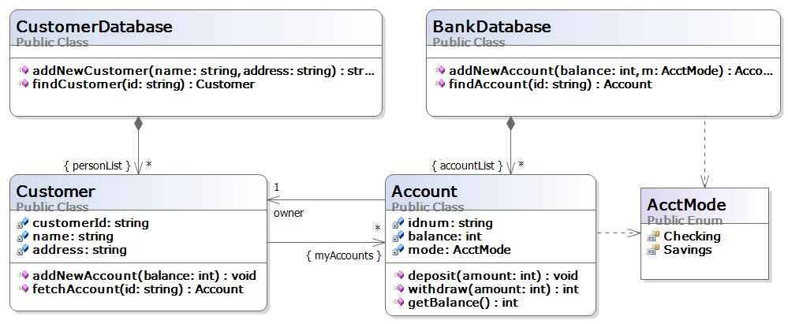
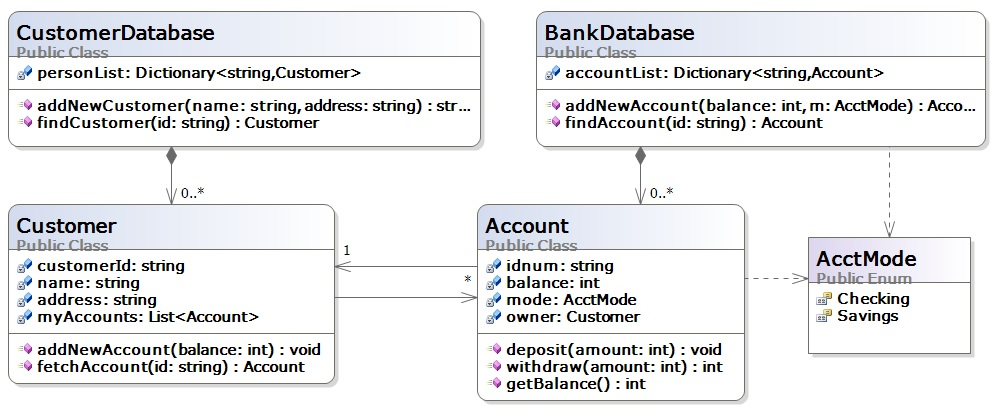
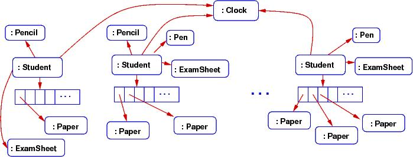
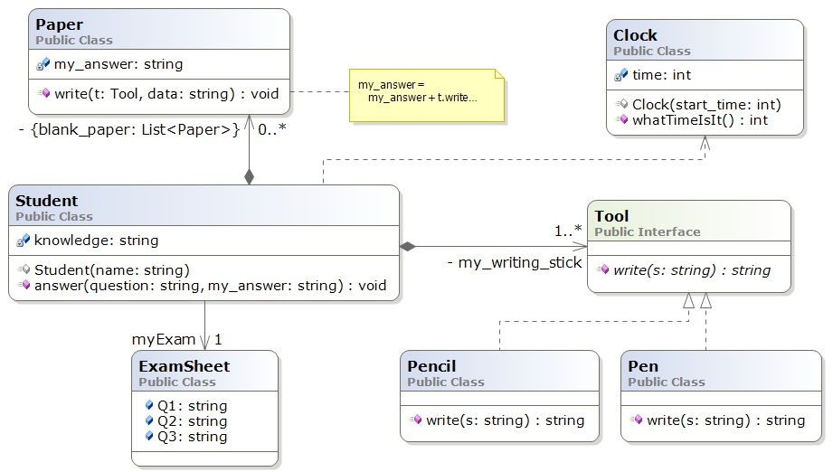

.. _class-diagrams:

Class Diagrams
##############

An object diagram is a "blueprint" of how storage is managed when a system
executes.
It is similar to the "traffic diagram" an architect makes of a building that
shows the movement of people through the building while the building is used.

But an architect also makes a "floor plan" of the building, which shows the
layout of rooms, halls, and stairs that will be constructed for use.

A class diagram is a blueprint of the components needed to build an executing
software system --- it is the "floor plan" of the software system.
It is the most important blueprint form that we learn in this course.

UML class notation is used to draw a class diagram. We use the variant that is
supported by Visual Studio, which is documented in the lecture note on 
:ref:`uml-notation`. 

Example: Bank Database
**********************

At the end of the previous lecture note (:ref:`storage-object-diagrams`), 
there were examples of object diagrams.
One was of a banking database. Here's a repeat of part of that system:

The object diagram shows how two "controller" objects "own" the multiple 
customer records (objects) and the multiple account records.
Further, a customer record holds handles to the accounts that the customer owns.

When we program the database, we write classes that can generate the object
diagram.
This means we need at least classes for ``CustomerDatabase``, ``BankDatabase``, 
``Customer``, and ``Account``. 
The classes will depend upon (reference) each other in the pattern shown in the
object diagram.

A class diagram shows the classes that must be written and the dependencies.
Here is a class diagram that defines the classes that must be coded to bring to
life the database:

Additional detail --- field names, methods --- are added to indicate what must
be coded to implement the database.

The meanings of boxes and arrows are documented in the lecture note on
:ref:`uml-notation`.
Here is a quick summary:

* The boxes represent entities: classes, enumerations, interfaces, and code
  fragments (the latter can also be comments).
  Within a class box, the fields and methods are listed.
  Within an interface box, the methods are listed.
  
* The arrows define relationships. For the above example:
  
  * A solid arrow defines *dependency* (coupling): "A refers to B", or
    "A needs B to compile correctly" and *"A retains a handle to B in a field."*
  
  * The dashed arrow defines dependency also, but where there is not a field to
    remember the entity depended upon.

  * A solid arrow with a diamond at its base defines *composition*: "A owns B" 
    or "B is part of A" or "if A dies, so does B".
    This is a stronger form of dependency and occurs when A constructs B.

  * A dashed line with a white arrowhead defines *realization*: implementation
    of an interface.

  * The label on a solid arrow gives the name of the attribute/field that is
    declared within the class, and the numerical-star information states the
    "multiplicity" --- how many of the object are remembered.
    Names of collections are enclosed in braces, and the ``-`` means private.
    Arrays, lists, dictionaries --- all are collections and are specified with
    the name in braces.
    (We do not write a ``class array`` or ``class List`` --- they are already
    built-in.)

The above format is standard and has been used for decades.
But some people find the labels on the arrows confusing.
When you use the Visual Studio to draw the diagrams, you can omit the labels if
you declare the correct fields, like this:

One advantage of this alternate approach is that *Visual Studio can generate your
C# code for you from the class diagram you draw* (see MSDN's 
`Generate Code from UML Class Diagrams <http://msdn.microsoft.com/en-us/library/ff657795.aspx>`__ 
article). 
(Of course, Visual Studio will not code the bodies of the methods, but it will
generate everything else!
This is a big payoff for drawing a class diagram before you start coding.)

Example: Exam Simulation
************************

Say we are designing a computer simulation of students taking an exam.
The students bring some blank paper, and some pencils and pens.
At the exam, each student gets a question sheet; all the students share
(well, look at) the big clock at the front of the room.

The computer simulation must construct objects for the entities just described;
here is an object diagram of what the exam simulation might look like while it
is executing:

The object diagram gives big clues about what classes must be written for the
simulation.
Here is a class diagram that could generate the above object diagram:

----

.. raw:: html

   
<small><em>
   This note was adapted from David Schmidt's CIS 501, Spring 2014, 
   <a href="http://people.cis.ksu.edu/~schmidt/501s14/Lectures/Lecture04S.html">Lecture 4</a>
   course note. © Copyright 2014, David Schmidt.
   </em></small>

    