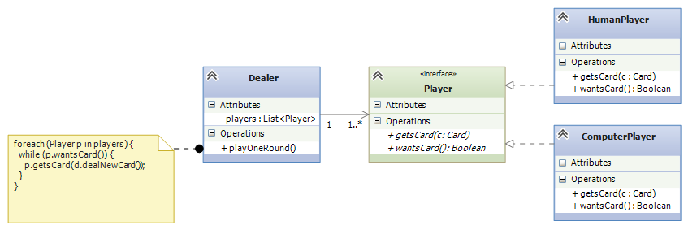

.. _interfaces:

Interfaces, Delegates, and Reactive Systems
###########################################

Components communicate by calling each other's methods.
If object ``A`` wants knowledge from object ``B``, ``A`` must know the name of
the method, ``f``, in ``B`` to call.
*The method names are more important than the class name.*

In this lecture, we learn how to use *delegates* and *interfaces* to define the
"data type" of a single method and the "data type" of a class-with-methods.
Both delegates and interfaces are hugely useful in practice for defining
"plug-in" connection points between code assemblies.

Interfaces: Specifications for Connection
*****************************************

An *interface* is a listing of the public methods an object must have to connect
or to be connected to others.
An interface is a "data type" of a collection of classes.
An example explains it best:

Interfaces as "Data Types"
==========================

Say we are assembling a computerized card game, where a dealer deals cards to
players.
Some players are human, some are computer players --- they're mixed together.
Regardless of the form of player, the dealer will ask a player if it wants a
card, and if yes, deal it one.

We might try this awkward coding of ``class Dealer``:

.. code-block:: c#

   // dealer for a card game of one human and one computer player:
   public class Dealer {  
     private HumanPlayer h;
     private ComputerPlayer c;
     private CardDeck d;  // deck of cards; has a  dealNewCard  method

     public Dealer(HumanPlayer h, ComputerPlayer c) {  this.h = h;  this.c = c; }

     public void PlayOneRound() {
       // ...
       while (h.wantsCard()) {
         h.getsCard(d.dealNewCard());
       }
       while (c.wantsCard() {
         c.getsCard(d.dealNewCard());
       }
       // ...
     }
   }
   
The duplicate code is bad, since both the human and computer objects are *called
the same way*.
Here is the situation, summarized in a class diagram:

We can improve this by using an *interface*:

.. code-block:: c#

   // a  Player  is any class that has these two methods with
   //   the behaviors described in the comments:
   public interface Player {
     // wantsCard  returns true when the Player wants another card:
     public bool wantsCard();
     // getsCard(c)  adds Card  c  to the hand held within the Player:
     public void getsCard(Card c);
   }

The interface describes the "type of class" that can be a player in the card
game.
We code ``class HumanPlayer`` and ``class ComputerPlayer`` to have the methods
listed in the interface:

.. code-block:: c#

   // HumanPlayer is the computerized "proxy" for the human;
   //   it _implements_ (matches) interface Player:
   public class HumanPlayer : Player {     // READ THIS LINE CAREFULLY!
     private HandOfCards h;
     // other fields
     // ... 

     public bool wantsCard() {
       Console.WriteLine("Do you want another card?");
       string answer = Console.ReadLine();
       return (answer == "Yes");
     }
     
     public void getsCard(Card c) { h.add(c); }

     // other methods
     // ... 
   }

   // ComputerPlayer is a computer card player; it also implements Player:
   public class ComputerPlayer : Player {
     private HandOfCards h;
     // other fields
     // ... 

     public bool wantsCard() {
       return (h.score() < 17)
     }
     
     public void getsCard(Card c) { h.add(c); }

     // other methods
     //...
   }

The two classes *implement* ``Player`` --- they have "data type" ``Player``.
The ``Dealer`` is simplified to deal to ``Player`` s:

.. code-block:: c#

   // dealer for a card game of Players:
   public class Dealer {  
     private List<Player> players;          // the players of the game
        // we use the interface name as the "data type" of the players
     private CardDeck d;     // the deck of cards

     // construct dealer:  pl  is a list of the Player objects
     //   that the dealer contacts
     public Dealer(List<Player> pl) {  players = pl; }

     // plays one round of the card game with the  players:
     public void PlayOneRound() {
       // ...
       foreach(Player p in players) {
         while (p.wantsCard()) {
           p.getsCard(d.dealNewCard())
         }
       }
       // ...
     }
   }

The coding is simpler and more general.
Here is the class diagram, showing how ``class Dealer`` is coded to depend on 
``Player``. 
On the "other side" of the interface, ``HumanPlayer`` and ``ComputerPlayer`` 
implement ("plug into") the interface:

Either or both of ``ComputerPlayers`` and ``HumanPlayers`` can "plug into" a 
``Dealer`` through the interface.

Interfaces as Connection Points
===============================

We use interfaces every day --- we call them "specifications" or "sizes" --- 
What size of shoe do you wear? (8 narrow? 9 1/2 wide?)
What type of battery do I need for my flashlight? (1.5 volt AAA?)
What kind of "dingle" do I need to connect this darned VGA cable to my MacBook?

The brand of shoe or battery or cable is unimportant --- the specification is
what matters.
An interface is a specification for a class you want to connect to ---
it is a "connection point" or "plug-in point".

Here is the typical software situation: A big software system must be divided
into subassemblies, and each subassembly is built by a separate team.
The teams work at the same time.
How can a team compile, build, and test its subassembly without the other
subassemblies?
How do we ensure that the completed subassemblies connect together correctly?

Answer: We use interfaces to define the connection points where one assembly
connects ("plugs in") to another.
Here is a diagram of three assemblies that connect together via two interfaces:

.. image:: assembly.png

Now, the ``Assembly1`` team can code and compile its own part of the system,
because they use interfaces ``ConnectionPointA`` and ``ConnectionPointB`` in 
their coding.
The team can even test their code by writing a simple, "dummy" (*mock*) class
that implements ``ConnectionPointA`` and running their tests with it. 
When it's time to combine the three subassemblies, the code projects link
together because all three were coded to match the two interfaces.
This is how system building is done.

Here are three examples of "plug-in" interfaces that you have likely used:

1. *Data structure plug-ins*: If you have dared to look at the .NET library,
   you know there is a huge collection of data-structure classes,
   some graphics-based, some storage-based, far too many to remember.
   Many of the data-structure classes have similar abilities (methods), and
   they use the same method names for doing the same actions.
   Interfaces are used to organize together those classes that do
   "the same thing".
   
   Look at the .NET reference page for 
   `System.Collections <http://msdn.microsoft.com/en-us/library/system.collections(v=vs.110).aspx>`__. 
   First, you see the names of the basic data structures supported by C#.
   Next, you see the ``interface`` s that are used to describe the "types" of data
   structures, e.g.,

   =====================  ==============================================================================
   **Interface**          **Description**
   ---------------------  ------------------------------------------------------------------------------
   ICollection            Defines size, enumerators and synchronization methods for all collections.
   IComparer              Exposes a method that compares two objects.
   IDictionary            Represents a collection of key-and-value pairs.
   IDictionaryEnumerator  Enumerates the elements of a dictionary.
   IEnumerable            Exposes the enumerator, which supports a simple iteration over a collection.
   IEnumerator            Supports a simple iteration over a collection.
   IHashCodeProvider      Supplies a hash code for an object, using a custom hash function.
   IList                  Represents a collection of objects that can be individually accessed by index.
   =====================  ==============================================================================
   
   .. raw:: html
      
      

   
   If you click on any of the interface names (try ``IList``, the "data type" of
   collections that are sequential and are indexed by non-negative ints),
   you will see the definition of the interface and the data structures that
   implement the interface.

   Another important interface is ``IDictionary``, the "data type" of table-like
   data structures that use (non-int) keys for lookups.

   Say you are building an assembly that relies on a table, but you do not want
   to commit to a particular coding of a table --- maybe it does not matter or
   maybe you want to leave this work to an expert --- then you code your
   assembly to depend on the ``IDictionary`` interface. The idea looks like
   this:
   
   .. image:: table.png
   
   That is, within the assembly, the table, no matter how it is implemented,
   can be indexed and assigned to and can be called with the methods, 
   ``Add``, ``Clear``, ``Contains``, etc. (see 
   `the methods listing in the .NET documentation <http://msdn.microsoft.com/en-us/library/system.collections.idictionary_methods(v=vs.110).aspx>`__).

   The assembly's code might be integrated like this:
 
   .. code-block:: c#
     
      // Main assembles my system:
      public void Main() {
        // define the system's main table:
        IDictionary main_table = new Hashtable();
        // or maybe:   IDictionary main_table = new HybridDictionary();
        // or any of the classes listed at
        //   http://msdn.microsoft.com/en-us/library/system.collections.idictionary_methods(v=vs.110).aspx

        // plug the main_table into the constructed assembly:
        Assembly my_assembly = new Assembly(main_table);
        // do more assembly work and start the system:
        // ...  
        myassembly.run();
     }

2. *Subassembly plug-ins*: Your company builds business systems
   ("Enterprise Information Systems"), which are structured like this::
   
       GUI ---> BusinessLogic ---> Database
   
   The user talks to the GUI, which relays commands to the Business Logic, which
   translates the commands into Database operations.

   GUIs are tricky to implement well, and specialists write these.
   Databases are also tricky to build, and specialists write these.
   Your company specializes in writing the Business-Logic assembly which
   understands the needs and commands of the user:
   You are given an interface for communicating with the GUI and an interface
   for communicating with the database, and you use these interfaces to write
   the Business Logic:
  
   .. image:: cont.png
   
   You "plug" a ``UserInterface`` and a ``Database`` into the ``Controller``.
   
   Your assembly must also have an interface so that your assembly can "plug"
   into the one that receives user inputs. (You can think of the ``- - ->``
   arrows into the ``UserInterface`` and the ``Database`` interface as "sockets"
   and the ``---|>`` arrow out of the assembly to ``ControllerInterface`` as a
   "plug with pins" that fits into a socket.)

   You test your Controller subassembly with simple-minded class-codings that
   implement the two interfaces and you "plug" your assembly into a test harness
   that generates calls to the ``handle_Input`` method.
   This assembly testing will minimize the headaches of testing the entire
   system when it is assembled with the actual subassemblies.
 
3. *Network plug-ins*: When networks became popular, so did Client-Server
   systems, where a client computer logs in and does business with a server
   computer --- in this way, a company's computers can share a common file
   system or data base.
   For clients to share a server, there must be standard methods for logging in,
   transferring data, etc. *CORBA* (Common Object Request Broker Architecture)
   is a standardized collection of interfaces that a Client server must
   implement to talk to a server.
   (A server computer has its own set of interfaces to implement to be a
   server.)
   
   The Client computer and Server computer connect through a piece of code
   called the Object Request Broker (ORB), that understands the Client and
   Server interfaces and so can match Client to Server for communication.

   You can read a simple description and see a simple diagram at the 
   `Wikipedia page for CORBA <http://en.wikipedia.org/wiki/Common_Object_Request_Broker_Architecture>`__.
   CORBA's interfaces make it easy for businesses to communicate with each
   others' servers.
   And web-based internet commerce (e.g., Amazon.com) is based on a similar set
   of interfaces that define the TCP/IP network protocol.
   

Abstract Classes
****************

In the example with the Dealer and card Players, you might have noticed that
both ``HumanPlayer`` and ``ComputerPlayer`` have duplicate codings of 
``getsCard``.
We can make an "interface" that holds a partial coding of a class.
This is called an *abstract class*. 
Here is the revised example, where the interface is replaced by an abstract
class:

.. code-block:: c#

   // a  Player  holds a hand of cards and has the two behaviors listed:
   public abstract class Player {
     protected HandOfCards h;  // note change of visibility of field
     // ...
     public abstract bool wantsCard();  // note that body of method is MISSING

     public void getsCard(Card c) { h.add(c); }
   }

   public class HumanPlayer : Player {
     // We must supply the coding for  wantsCard:
     public bool wantsCard() {
       Console.WriteLine("Do you want another card?");
       string answer = Console.ReadLine();
       return (answer == "Yes");
     }
   }

   public class ComputerPlayer : Player {
     public bool wantsCard() {
       return (base.h.score() < 17) // say  base.h  to use var  h  in the superclass
     }
   }

The abstract class removes duplicate coding, but it splits the classes into
two pieces, which makes them harder to understand.
*Use an abstract class only when there is a significant reduction in redundant
coding.*
Otherwise, stick with interfaces, which are simpler and safer.

Reactive Systems
****************

A console application is controlled by the commands in the ``Main`` method --- 
this is the "algorithm." The human might be asked to participate and supply
input, via ``Console.ReadLine()``, but the algorithm in ``Main`` controls what
is done in what order.
Traditional programs are built in this style.

A simulated card game is controlled by the algorithm inside the game's Dealer
object, which acts as a "referee" and enforces a "protocol" (rules of play).
*The Dealer controls the game.*
The human might supply input, but the Dealer controls what is done and in what
order.

Yet another form of program is a *reactive system* --- a program that is
*controlled by its inputs*.
A vending machine is a classic reactive system: the machine (and its software)
waits for input (e.g., coins inserted).
The input triggers some computation, and the machine again waits for input (this time, a press of a button to select a candy bar) which triggers more computation.

A VS Forms application is a reactive system: the ``Main`` method activates a 
Form (via ``Application.Run(new Form1())``), and the Form waits on user 
input (a button press or text entry) --- these are called *events* --- to react 
to. 
An event calls an *event handler* method (e.g., 
``private void button1_Click(object sender, EventArgs e)`` when ``button1`` is 
pressed) that does computation.

Delegates: How Events Trigger Computation
*****************************************

Say you build a Forms application with a button, ``button1``, and you want the
code in 
``private void button1_Click(object sender, EventArgs e)`` to execute when the
button is pressed.

When you tell Visual Studio to register ``button1_Click`` as the event handler
for ``button1`` (look at the Properties window for ``button1`` and you will find
this information displayed), Visual Studio generates hidden code that saves the
"handle" for the method (the "address" of the method's code --- where to "jump")
in a table buried deep inside the package, ``System.Windows.Forms``.

* Deep down within ``System.Windows.Forms`` is this *delegate declaration*:

  .. code-block:: c#
  
     public delegate void ClickHandler(Object sender, EventArgs e);
  
  The delegate declaration defines *an interface for a single method* (and not
  an entire class).
  A delegate declaration is a "data type" of a single method. In this case, the
  ``ClickHandler`` type is the type of a method that takes two arguments, an
  ``Object`` and an ``EventArgs``, and returns a void answer.
  
* Also deep down in ``System.Windows.Forms`` is this method:

  .. code-block:: c#
  
     public registerClickHandler(Button b, ClickHandler h) {
       // ...
       event_table[b] = h;   // remember that clicks of  b  should trigger  h
     }
     
  When you ``register button1_Click`` as the event handler for ``button1``,
  Visual Studio generates this code:

  .. code-block:: c#
  
     System.Windows.Forms.registerClickHandler(button1, button1_Click);
     
  which adds the information to the internal ``event_table``.
  *Notice that ``button1_Click`` has "data type" ``ClickHandler``* --- 
  ``button1_Click`` "implements" the delegate "interface".
  
* Later, when ``button1`` is pressed, the code in ``System.Windows.Forms``
  consults the ``event_table``, finds the entry for ``button1``, and *calls its
  method directly (jumps to it)*, not even knowing the method's name or where
  it came from. It executes this code:

  .. code-block:: c#
  
     ClickHandler handler = event_table[button1];   // fetch method from table
     handler(button1, [...list of info about the click...]);   // call it!
     
  And this is how the code you wrote in ``button1_Click`` gets executed when you
  press ``button1``.
  
Because of the delegate declaration, ``ClickHandler``, inside 
``System.Windows.Forms``, the developers of ``System.Windows.Forms`` were able
to write "their subassembly" for event handling so that it "plugs into" the GUI
you design when you use Visual Studio.

Again, *think of a delegate declaration as an interface for a single method*.
It can be used like an interface to make a "connection point".

(A method that implements a delegate interface is called a *delegate object*.
There are some technical details about a delegate object ---
the object holds both the handle to the method and also a handle to the frame
where the method's nonlocal variables (class fields) live.
A delegate object is also called a *closure object*, which is older terminology.
We leave it at that; take CIS505 to learn more....)

Soon, we will use delegate declarations and delegate objects in our own coding.
See the note on :ref:`delegates` to see how delegates are commonly used in
systems coding.

Models and Controllers in Reactive Systems
******************************************

Here is critical terminology:

* **Every program has some data structures (tables, trees, lists, databases) to
  be maintained.
  In an object language, a data structure is declared as a field within a class,
  along with methods that know how to do lookups and updates on
  the data structure.
  Such classes are called** *model classes* **or** *entity classes*.

* **Every program has an algorithm that knows the correct order of
  commands/rules/protocol for building/maintaining the data structures.
  In an object language, the algorithm is called the** *controller*.

* **Every program has an input/output device or display or user-interface. 
  In an object language, the device/display/UI is defined within a class,
  called the** *view class* **or** *boundary class*.

If you use Visual Studio to construct a Forms application, you know that 
``class Form1`` is the view class --- its job is to accept input and show output.
You must write some additional, separate classes to define program's model.
These classes are usually coded as a separate Project or Solution.

*But what about the controller?* If you are a Visual Studio user, you can be
lazy and insert the controller as code inside 
``private void button1_Click(object sender, EventArgs e)``, which resides inside
``class Form1`` as the event handler for a button press.
If you do this, you are basically forced to declare the model objects as fields
inside class ``Form1`` as well.

Congratulations! Visual Studio has led you to mush together the model,
controller, and view assemblies inside ``class Form1``, the template for
generating a GUI Form!
This is a bad design that is never used in practice, because teams of engineers
must develop the Model, View, and Controller assemblies separately,
test them separately, and assemble them with interfaces.
We must learn how to do this properly.

----

.. raw:: html

   
<small><em>
   This note was adapted from David Schmidt's CIS 501, Spring 2014, 
   <a href="http://people.cis.ksu.edu/~schmidt/501s14/Lectures/Lecture05S.html">Lecture 5</a>
   course note. © Copyright 2014, David Schmidt.
   </em></small>

    