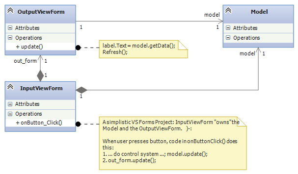

.. raw:: html

    
   
   <big><big><b>
   
Course Notes --- CIS 501: Software Architecture and Design, Fall 2014

.. raw:: html

   </b></big></big>
   

.. _coupling-mvc:

Coupling and the Model-View-Controller (MVC) Architecture
#########################################################

The ending of the previous lecture should have you wondering ---
what is the best way to design a single-user reactive software system with
"independent" sub-assemblies?

This question also intrigued the researchers at Xerox's Palo Alto Lab (PARC)
in the 1970s when they wrote the first GUI-based systems in Smalltalk,
a Simula67-like object language implemented on top of Lisp.

The Xerox researchers quickly learned that it was critical to *isolate* the
assemblies so that there was independent development, containment of execution
errors, smooth maintenance, and component reuse.
The style of connectivity they used became known as the
*Model-View-Controller* (MVC) software architecture.
We will study it here.

Coupling
********

A component, ``A``, is coupled to component, ``B``, if ``A`` depends on ``B``,
in the sense of UML class diagrams --- ``A``'s code needs ``B``'s code to
compile;
if ``B``'s public fields and methods are changed, then ``A``'s coding must
change;
if ``B`` works incorrectly, then so will ``A``; if ``A`` is extracted for reuse
in a new system, ``B`` must be extracted, too.
*Large software systems must minimize coupling* so that compile errors and
execution errors are limited in scope;
components can be tested, plugged, unplugged, and replaced easily;
and sub-assemblies can be saved and reused in subsequent systems.

Couplings are a key feature in modern software architectures.
Here is an important case study:

Architecture for A Multi-Window Reactive System
***********************************************

Software systems like games, spreadsheets, and IDEs accept input from multiple
sources and produce output to multiple windows.

A standard example is an IDE like Visual Studio: It consists of multiple windows
(main window, edit window, toolbox window, solution window, and debug windows).
Input is entered into all of these windows (text entry and mouse clicks), and
input entered into one window can affect multiple other windows.
(Example: you type the text for a label in the solution window, and the change
shows in the solution window and also in the edit window.
Or, you click "Start Debug" in the main window, and a breakpoint appears in the
edit window and the call stack and local variables appear in the debug windows.)

It is a major problem coordinating input and output when there are multiple
windows (Forms).
We now study the architectures that might apply.

Let's consider the simplest version of this problem: A baby reactive toy uses
a model (data structure + operations), a controller (algorithm/protocol), and 
wo views (forms), one that accepts input and the other that displays output ---
input entered into the input view causes computation on the model and generates
changes to the output view, which displays information from the model.

Version 1: Naively Mixing Control with The View
===============================================

This is a naive Visual-Studio-style implementation, where the controller code is
coded inside the ``private void button_Click(object sender, EventArgs e)``
method, which sits in the ``InputViewForm`` class, which itself owns all the
system's components:

The relevant code for this diagram reads like this:

.. code-block:: c#

   public partial class InputViewForm : Form  {
     private Model model = new Model();
     private OutputViewForm form = new OutputViewForm();

     public InputViewForm() { InitializeComponent(); }

     private void onButton_Click(object sender, EventArgs e) {
       //...  
       model.update();
       out_form.update();
     }
   }

  static class Program {
    static void Main() {
      Application.EnableVisualStyles();
      Application.SetCompatibleTextRenderingDefault(false);
      Application.Run(new InputViewForm());
    }
  }

*This is bad.*
It is bad because the entire system lives in the Form that handles input events.
How can one team (typically the software engineers) develop the control and
the model and another team (typically the graphical designers) develop the view,
when all of these are mixed into one file?

Further, how can the components be extracted for reuse in future systems?
And, why should a GUI with a button "own" the output form and also the system's
model (data base)?
Will this architecture generalize to multiple forms where each form accepts
input and shows output?

Measuring The Architecture's Coupling
=====================================

The above doesn't sound good, and the problem is that there is
"too much"/"too strong" coupling (dependency).
There is a simple way to measure "degree of coupling" of a class-diagram
assembly, ``A``, in terms of ``A``'s sub-assemblies:

* Let ``N(A)`` is the number of classes in ``A``.
  Define the number of sub-assemblies, ``S(A)``, as the number of subgraphs of
  ``A`` that contain at least one class and have no outgoing edges.
  
  (An edge in a subgraph is outgoing if it starts at a node in the subgraph and
  has an arrow to a node outside the subgraph.)
  
* Diagram ``A``'s coupling ratio, ``C(A)``, is the ratio of sub-assemblies per
  class: ``C(A) = S(A) / N(A)``.
  
The larger the value of ``C(A)``, the better --- If there are more subassemblies
per component, this means there are more possible ways of disassembling the
system so that we can design, code, and test the system in stages.
We can also find more ways of disassembling the system so that we can reuse its
parts in other systems.

For the above architecture, ``V1``, we have ``S(V1) = 3`` and ``C(V1) = 3/3 = 1``. 
That is, there are only 3 sub-assemblies (including the entire system) that we
can extract and reuse out of this 3-component system.
We can do better.

Version 2: Controller Separated from Views
==========================================

We simply must untangle the controller code and model from the views:
We extract the control code from the event-handler method
(``private void button_Click(object sender, EventArgs e)``) in the input form
and place it in its own class.
Also, the model is not owned by any other assembly:

.. image:: V2.png

*This is better.*
When you implement this architecture in Visual Studio, construct and connect the
``InputView``, ``Controller``, and ``Model`` objects in the ``Main`` method of
``Program.cs``.
(For the above, the ``OutputView`` is still constructed and owned by the
``InputView``.)
Here's how to do it:

.. code-block:: c#

   public partial class InputViewForm : Form  {
     private OutputViewForm out_form;
     private Model model;
     private Controller cont;

     public InputViewForm(Controller c, Model m) { 
       InitializeComponent();  cont = c;  model = m; 
       out_form = new OutputViewForm(model);
     }

     private void onButton_Click(object sender, EventArgs e) {
       cont.handle();  out_form.update();
     }
   }

   static class Program {
     public void Main() {  // construct and connect the components here:
       Model m = new Model();
       Controller c = new Controller(m);
       InputViewForm i = new InputViewForm(c, m);  
       // ...
       Application.Run(i);  // give control to the input view
     }
   }

Now, the ``Main`` method's code documents the software architecture ---
you read it first to learn about the system.
Also, this architecture makes it easier to extract sub-assemblies for coding,
testing, and future reuse.

For this system, ``V2``, we have ``S(V2) = 5`` and ``C(V2) = 5/4 = 1.25``,
better than before.

It is still a (minor) problem that the input view owns and contacts the output
view.
Also, we would like to separate (decouple) the input view from the controller.
This is because the input view (the "user interface", the "GUI") is often
developed in a different language and in a different design tool than
C#/Visual Studio.

Finally, modern GUI-based systems (like Visual Studio!), use multiple input
views/forms and also multiple output views/form.
We want a software architecture where it is easy to add and remove views, even
while the system is executing.
(Think about how windows appear and disappear when you run Visual Studio.
What happens is more that just Showing and Hide-ing windows ---
windows are constructed, attached, used, removed, and deallocated.)

Version 3: Model-View-Controller
================================

Now we study the first version of the Model-View-Controller (MVC) architecture.
This version works well when there is just *one controller object that handles
all input events and does all model updates*:

.. image:: V3.png

The key(s) are the delegate declarations.
(Recall that a delegate is an "interface/data-type that specifies a single
method.")

* The input view depends on ``delegate inputHandler``, which specifies the type
  of method that should be called when there is an input event.
  
* Delegate ``Observer`` specifies the type of method(s) that are called when
  the model is updated and the output view(s) should be called to repaint their
  displays.
  Each output view's ``update`` method implements the ``Observer`` delegate,
  and *it is* **register**-ed *with the controller*, in the controller's
  registry.
  (See the code just below.)

The remaining dependencies are:

* The controller depends on the model, because the controller's purpose is to
  enforce the algorithm/protocol for calling the model's methods.

* The output view depends on the model, because the output view's purpose is to
  display a representation (a "view"!) of the model on the display.
  (If an output view/form is written in a language/tool different from C#/VS,
  we can insert a delegate declaration between the output view and the model.)

The ``Main`` method assembles the system and registers the ``Observer`` (s):

.. code-block:: c#

   // the type of method that handles input events:
   public delegate void InputHandler(); 
   // the type of method that calls output views when there is a "model-update event":
   public delegate void Observer(); 

   static class Program {
     public void Main() {
       Model m = new Model();
       Controller c = new Controller(m);
       InputViewForm i = new InputViewForm(c.handle);  // recall that  c.handle  has type InputHandler
       OutputViewForm f = new OutputViewForm(m);
       f.Show();    // C# requires that you tell an output form to show itself
       c.register(f.update);   //  f.update  has type  Observer
       // ...
       Application.Run(i); 
     }
   }

When there is an input event, the ``InputViewForm``'s ``onButton_Click`` method
(indirectly) calls ``handle`` in the controller, which executes the
algorithm/protocol for the input event.
*The input view/form is not coupled to any controller or model*.
This makes it easy to develop the input view separately from the rest of the
system.

When the controller does a model update, all methods saved in registry are
called.
So, *the controller is not coupled to any view*.
This makes it easy to extend the system to have multiple forms (views) for
inputs and outputs, like a spreadsheet or IDE does.
It makes it easy for views to "come and go" while the system is executing.
This is a standard technique in systems building, maybe the most important one
you will learn in this course.

For this system, call it, ``V3``, we have ``S(V3) = 9``, and 
``C(V3) = 9/4 = 2.25``, which shows marked improvement.

An important variation on the above is to save the registry in the Model.
Here is the revised sub-assembly:

This arrangement can be used when there are multiple input views, each of which
contacts a distinct controller object to update the model.
In such a situation, the registry cannot be saved in any one of the controllers,
so we can save it with the model.

The previous arrangement is a bit less attractive because Model components
("data structures") are rarely written with registries embedded in them.
This flaw is repaired in Version 4, below.

**Principles of MVC design**

* Controllers are written to compute answers and to control/enforce the proper
  use of models (the "proper use" is the "protocol" or the "rules of the game"),
  so controllers are typically coupled to (depend on) the models they control.

* Output views are coupled to models, because the purpose of an output view is
  to display/pretty-print information embedded in a model.
  No component should be coupled to an output view.

* Models should not be coupled to any other assembly.

* If they are coupled to any other component, an input view/form is coupled to
  the controller that does the computation requested by the input event.
  No component should be coupled to an input view.

Version 4: Xerox PARC-style MVC with Sub-classing: Observer Design Pattern
==========================================================================

Here is an improvement on the immediately previous architecture,
where there are multiple controllers that update the model:
We store the registry of observers in a super-class to which the model attaches:

.. image:: V4b.png

Now, the model component extends (is a subclass of) an "observed model", which
is a class that holds the registry.
This last pattern was the version of MVC developed by the Xerox PARC team.
It is called the *Observer design pattern*.
Here is the pattern of coding you can use:

.. code-block:: c#

   public delegate void InputHandler(...);  // data type of input-event methods
   public delegate void Observer();  // data type of output-refresh methods

   public abstract class Observed Model {  // "abstract" means "unfinished"
     private List registry = new List(); 
     public void register(Observer x) { registry.Add(x); }
     public void notify() { foreach(Observer x in registry) { x(); } }
   }

   public class Model : ObservedModel {
     private Data mydata;
     // ...
     public void update(...) { mydata = ...; }
     public string getData() { ... return mydata; }
   }

   public class Control {
     private Model m;
     // ...
     public void handle(...) { m.update(...);  m.notify(); }
   }

   public class InputViewForm {
     private Button button1;
     private InputHandler han;
     // ...
     public void button1_Click(...) { han(...); }
   }

   public class OutputViewForm {
     private Label label1;
     private Model m;
     // ...
     public void repaint() { label1.Text = m.getData();  this.Refresh(); }
   }

   public class Program {
     public static void Main() {
       // ...
       Model model = new Model();
       Control c1 = new Control(model);
       InputViewForm f1 = new InputViewForm(c1.handle);
       Control c2 = new Control(model);
       InputViewForm f2 = new InputViewForm(c2.handle);
       OutputViewForm o1 = new OutputViewForm(model);
       model.register(o1.repaint);
       OutputViewForm o2 = new OutputViewForm(model);
       model.register(o2.repaint);
       f1.Show();  f2.Show();  o1.Show();  o2.Show();
       Application.Run();
     }
   }

The subclass arrangement places the registry in a central place, at the model
object, so that *multiple forms and controllers can correctly share the model*.
Also, the observed model knows nothing about the class names of the forms that
link to it --- it is completely decoupled from the view assembly.
   
   
Model-View-Controller "topology"
********************************

The key feature of MVC architecture is the "triad" or "triangle topology" of
assembly::

          IN/OUT Views
           |     \
           |      \
           |       \
           V        V
    Controller ---> Model
    

1. When there is an input event, the (input's) view contacts the controller.

2. The controller executes the correct protocol (algorithm) to update the model.

3. The relevant output views are *signalled indirectly via delegate calls* to
   query the model for the results, which are displayed.
   
The connection of output view to model, along with Step 3, are called the
*Observer design pattern*.
A design pattern is a coding scheme for doing some task correctly in an object
language.
In this case, the Observer design pattern gives a solution to the problem of
updating multiple output views when a model has changed value.

Once again, here are some principles of MVC design

* Controllers are written to control/enforce the proper use of models, so
  controllers are typically coupled to (depend on) the models they control.

* Output views are coupled to models, because the purpose of an output view is
  to display/pretty-print information embedded in a model.
  *No component should be coupled to an output view.*

* Models should not be coupled to any other assembly.

* If they are coupled to any other component, an input view is coupled to the
  controller that does the computation requested by the input event.
  No component should be coupled to an input view.

We will encounter more design patterns as we study more architectures.

Variations of MVC
*****************

The MVC architecture works great for systems with multiple input and output
views/forms.
There are two important alternatives:

Model View Presenter: One View does input and simplistic output
===============================================================

For very simple reactive systems, where there is just one, simplistic view,
we have this greatly simplified variant of MVC, called Model View Presenter.
It has a linear topology and uses function call-return to do its work::

    In&OutView           1. In&OutView calls Presenter with input event.
        |                2. Presenter computes answer, updates Model, 
        V                   and queries Model for new values of data.
    Presenter               Presenter returns the new data values as
        |                   the answer to the call in Step 1.    
        V                3. In&OutView displays the returned answer.
      Model

The architecture places a burden on the Presenter component, which
both implements the system's algorithm and knows exactly the data that must be
displayed.
You will find this architecture in some business systems, e.g.,
an ATM connected to a bank or a calculator tool --- the output view shows just
a single number or a single string.

Model View Binder: Using an XML/HTML-based View
===============================================

This architecture was developed by Microsoft (and called "Model View ViewModel")
to match their WFP and Silverlight system, but it resembles the layout used in
many Enterprise Information Systems (EIS).
It is a "web-browser-view plus model plus controller":

Say we have a general-purpose output view, essentially a web-browser, that
can show output formatted in some XML-like language.
(XML is a "bracket language"; HTML is one instance of XML).

The controller not only signals the model to do updates, but it then fetches
updated data from the model and formats it as an XML document.
Then the output view fetches the XML document and displays it::

           InView  OutView
             |         |
             V         V
           Binder - ->delegate Observer
             |
             V
           Model        

The controller is called a "Binder", because it does data bindings of the
model's data to names and layout in the XML document it builds:

1. The InView signals the Binder with an event.

2. The Binder updates the Model and queries the model for the new values of data.

3. The Binder organizes the new data into data bindings --- a structure or
   "template" of how the data should be presented to the user.
   The template is coded as an XML document and held in the Binder.

4. The Binder signals, say, by delegate call, that all Observers should retrieve
   the template for presentation.

5. The Outview, which is registered as an Observer, retrieves the XML document
   and displays it.

Like the Presenter component, the Binder has multiple responsibilities.
Unlike the Presenter, the Binder organizes in a semantically important way how
the data must be viewed.
Note that the Binder is not coupled to the OutView, so that the Binder and the
Model can be designed and tested independently of the views.

When used for internet commerce, the InView and OutView are often merged
together as a web browser or some XML/HTML-based viewer.
The Binder is often a "proxy object" (we study this notion later) that was
specially constructed by the Model and sent over the Web to the web browser to
act as that browser's personal Binder.
The Binder contains the "business logic" for doing the commerce transactions.

**Do not do this:**

Perhaps the worst layout for a reactive system would be just one view/form that
implements both input and output with this pattern of communication::

           In&OutView             1. View contacts Controller
           |        ^             2. Controller updates Model
           V        |             3. Model sends updated info to View
    Controller --> Model

Beginners code reactive systems like this; there is only one subassembly of this
"circular" system!

Weak and Strong Coupling
************************

``C`` measures coupling.
We say that a revised architecture is more *weakly coupled* than its predecessor
if its ``C`` measure is higher.

    Weaker coupling means more independence of components and more
    sub-assemblies --- more ways to disassemble, code, test, unplug, replug,
    reuse.

Weaker coupling is good.

A system is strongly coupled if its components depend on many other components,
meaning fewer subassemblies exist.
Strong coupling is bad.

The coupling measure, ``C(A)``, of assembly ``A`` is not the final judge of 
``A``'s quality, but as a rough rule, ``C(A)`` should be at least 1.0 ---
otherwise, something is wrong if a component system cannot be untangled into as
many sub-assemblies as there are pieces in the assembly.
In such a case, there is no benefit from writing the assembly in pieces.
(The underlying problem might be a lack of cohesion, which we study next.)

Distributed Control
*******************

A controller holds a system's algorithm. An algorithm is a script of commands or
a protocol for maintaining and using the system's data structure(s).

Say you have a reactive system that maintains two data structures
(model/entity classes) ``A`` and ``B``.
The system has just one boundary class (view class) with one or more buttons.
Sometimes, a button press triggers an update to data structure, ``A``, and 
sometimes, a button press triggers an update to data structure, ``B``.
There are no relationships between ``A`` and ``B``.

A simple implementation of the system would use one controller that executes the
``A``-update algorithm and the ``B``-update algorithm::

                                +--> A
                               /
    View --> ControllerForAandB 
                               \
                                +--> B
    
This architecture, call it ``X1``, is simple, but the controller is actually
two algoriithms --- one for ``A`` and one for ``B`` --- unnaturally glued
together; note that ``S(X1) = 5``, and ``C(X1) = 1.25``.

Since ``A`` and ``B`` are unrelated, so should be their controllers::

         +--> ControllerForA --> A
        /
    View 
        \
         +--> ControllerForB --> B

This architecture, call it ``X2``, is better, because it exhibits distributed
control --- the update algorithms in the controllers are married to the entities
(models), not the view.
We have ``S(X2) = 9`` and ``C(X2) = 1.8``. This is a reminder that:

i.  a controller manages a data structure (and not a view), and

ii. distributed control creates weaker coupling.

Distributed control is good.

This small example should make us think about how large systems sometimes use
algorithms that are naturally divided into pieces, depending on the data
structures they use.
This is not exactly a radical idea --- the main reason for writing
procedures/subroutines in a program is to divide up the algorithm into natural,
understandable pieces.

We consider the development of controllers in a future lecture.

Cohesion
********

The previous experiment with data structures ``A`` and ``B`` showed that
something was "wrong" with a controller that held two unrelated protocols, one
for ``A`` and one for ``B``.
"Unrelatedness" is bad for classes in object languages;
each class should present exactly one concept, and all the members
(fields and methods) in the class are about that one concept.

A component is *cohesive* if it is "about" one concept.
We can understand the notion by looking at coding style.
This class is "about" the concept of a playing card:

.. code-block:: c#

   public class Card {
     public readonly Count count;
     public readonly Suit suit;

     public Card(Count a, Suit b) { count = a;  suit = b; }

     public int BJvalue() {
       int i = (int)count + 1;
       if (i > 10) { i = 10; }   // in Blackjack, face cards have value 10
       return i;
     }

     public override string ToString() { return count + " of " + suit; }
   }

In generate, a cohesive class will manage one data structure, along with a few
primitive variables related to the structure:

.. code-block:: c#

   // This models one real-life entity:
   class OneFormOfEntity {
     // there is a primary data structure that characterizes the entity:
     private ... oneDataStructureThatHoldsTheEntitysKnowledge;

     // additional fields might help maintain the data structure:
     private int aPrimitiveVarThatIsCountingSomething;

     // the constructor method initializes the fields:
     public OneFormOfEntity(valuesForInitializingTheEntity) {
       // ...
     }

     // methods define abilities that the entity has 
     //   (i) to say and do things and (ii) to learn things.
     // Each method uses most or all of the fields to do its work.
     public SomeProperty DoSomethingLookupSomething(....) {
       // ... 
     }
 
     public void LearnSomethingUpdateSomething(...) {
       // ... 
     }
   }
   
The class is about modelling one entity --- one card player or one card or 
one spreadsheet or one text file or one widget.

In contrast, a class that, say, defines both the structure of a playing card as
well as the structure of a card deck has poor cohesion,
because it is "about" two entities.

A cohesive component has fields that are referenced by almost all of its
methods.
Here is the "litmus test" that you use: *a cohesive class cannot be rewritten
into two separate classes without damaging (recoding) most of its methods*.

Measuring Cohesion
==================

If you like numbers, here is a formula for calculating a numerical score of
cohesion:

* Say that class ``D`` has ``F(D)``-many fields and ``M(D)``-many methods.
  Say that field ``f``:sub:`i` is referenced by ``m``:sub:`i`-many methods in 
  ``D``.
  Then, the cohesion of ``D``, called ``H(D)``, is related to the number of times
  each of ``D``'s fields is referenced by ``D``'s methods:

  ``H(D) =  (m1 + m2 + ... + mM) / (F(D) * M(D))``
  
``H`` measures the percentage of fields required by each method.
The maximal cohesion value is ``H(D) = 1`` --- every field is required by every
method.
For example, for this class:

.. code-block:: c#

   public class Card {
     public readonly Count count;  
     public readonly Suit suit;  

     public Card(Count a, Suit b) { count = a;  suit = b; }

     public int BJvalue() {
       int i = (int)count + 1; 
       if (i > 10) { i = 10; }   // in Blackjack, face cards have value 10
       return i;
     }

     public override string ToString() { return count + " of " + suit; }
   } 
       
``H(Card) = (3 + 2)/(2*3)`` which equals ``0.83`` (because count is referenced
by 3 methods and ``suit`` is referenced by 2 methods).
If you do some calculations, you will find that well-written, "cohesive" classes
have ``H``-values near 1, and non-cohesive classes (those that can be readily
rewritten into two classes without recoding many methods) have ``H``-values less
than ``0.5``.
The net result is that using a cohesive component in a system means the system
will have weak(er) coupling --- the component does not cause a "cluster" of
dependent components to form around it.

Software Metrics
****************

The definitions of ``C`` and ``H`` are my own invention, meant to give you a
concrete way to measure coupling and cohesion.

There is an area of experimental computing, called software metrics, that
studies mathematical formulas for blueprints and code and applies the formulas
to predict development times, maintenance costs, and "software complexity".
You can look at the Wikipedia page for examples.
(There are entries about how people have tried to measure coupling and cohesion
in real-world systems.)

Visual Studio can compute code metrics values for your solution automatically
(see MSDN's
`Measuring Complexity and Maintainability of Managed Code <http://msdn.microsoft.com/en-us/library/bb385910.aspx>`__
article).

---

.. raw:: html

   
<small><em>
   This note was adapted from David Schmidt's CIS 501, Spring 2014, 
   <a href="http://people.cis.ksu.edu/~schmidt/501s14/Lectures/Lecture06S.html">Lecture 6</a>
   course note. © Copyright 2014, David Schmidt.
   </em></small>

    