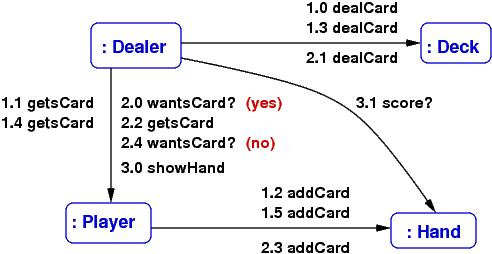
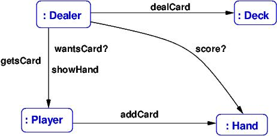
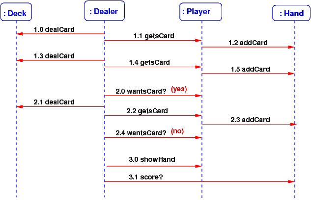
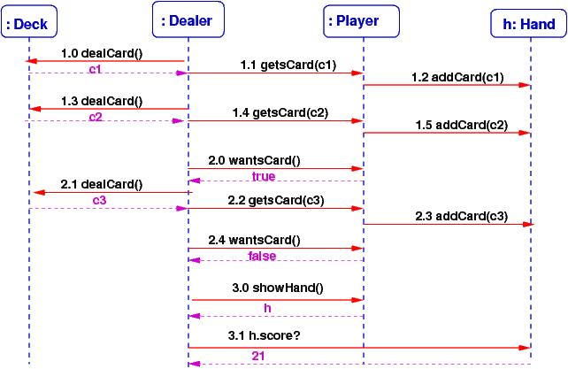

.. raw:: html

    
   
   <big><big><b>
   
Course Notes --- CIS 501: Software Architecture and Design, Fall 2014

.. raw:: html

   </b></big></big>
   

.. _use-cases:

Use Cases and Diagrammatic Realizations
#######################################

Where do object and class diagrams come from?
We now study a way to discover them.

When someone wants a machine built, they tell us how they want the machine to
behave when they use it.
They give us examples, and we develop the machine's structure and control from
the examples.

An example behavior is called a *use case*.
A use case is a "round of play" of a game, or a "session" with a tool, or
a "transaction" with a reactive system.
*It is the input-output description of the system we must build.*
It describes *external behavior*.

Example: a use case of a candy-bar vending machine goes like this:

i.   human inserts bill;

ii.  human presses button with picture of candy bar;

iii. matching candy bar falls out of machine and onto floor.

Use Case Realization
********************

A use case describes external behavior, from the user's perspective.
But there is also the *internal* behavior that occurs from the machine's
perspective.
When we include the latter into the use case, we have a *use-case realization*
that tells us how the machine operates.
*It is the "high-level algorithm" of the system we must code*.
For the candy machine, the use-case realization might go like this:

i.   *human inserts bill*
   
     The machine's bill slot rolls the bill under a scanner that checks the
     authenticity and the value of the bill.
     The value goes to the machine's money controller, which tells the machine's
     "database" how much money was inserted. The controller also enables the
     appropriate buttons for candy bars.
     The bill drops in the money box.
     
ii.  *human presses button with picture of candy next to it*

     The button-press event notifies the button's controller for the selected
     candy bar.
     The button's controller tells the database to subtract the price of the bar
     from the amount deposited, and it also tells the candy-bar bin to release
     one bar (which it does --- we hope!)
     A signal/event goes to the change-box to issue coins for change
     (which it does --- we hope!).
     Signals go to all button controllers to disable the buttons for candy bars.

iii. *matching candy bar falls out of machine and onto floor*

The use-case realization talks about entity objects, both hard(ware) and 
soft(ware);
multiple controllers for money and buttons and change; a money box and a
"database";
and buttons and pictures of candy bars (the machine's boundary entities ---
the "view").

Notice that the use-case realization uses *nouns that name the internal
components* and *active verbs that state the actions* the components take.
(Example: "The button's controller tells the database to subtract the price of
the bar....")

When we write a use-case realization, we force ourselves to use nouns that name
the internal components and use active verbs that state actions --- the nouns
suggest the classes/objects we must build, and the verbs suggest the methods we
must write!

With enough use cases documented and realized, we can build a machine that does
all the desired behaviors.
Use-case realizations help us design the class diagram and code the classes.
(In the "old days", the use-case realizations were called
"high-level algorithms" --- the outlines of the code we must write.)

Here is a use-case realization of one round of a simulated Blackjack card game,
where a human plays against a "house player".

When writing the realization part, we should first think about which "entities"
will be part of the realization.
For a card game, this means Cards, a Deck, human and computerized card Players,
and a Dealer.
The use-case realization explains what the entities do:

1. *human and house (computer) player each get two cards*::

       for each Player p, both human and computerized:
         Dealer deals two cards from the Deck and gives them to  p
          
2. *Dealer checks if either player has already scored 21.
   If yes, the round ends here*::

       if human's score == 21 or dealer's score == 21,
         determine the result of the round --- win, loss, tie  (details supplied later);
         terminate round
       else continue:
       
3. *human is repeatedly asked if more cards are desired. Cards are dealt till
   human says no or reaches 21 or "busts"*::
   
       for each Player p, first the human and then the computerized,
         Dealer asks:
           while p wants a card and p's hand's score <= 21 :
             Dealer deals a card from the Deck and gives it to  p

4. *human sees the results*::

       for each Player p:
         p  shows its hand to the Dealer so that the Dealer can calculate
            the hand's score and display the results.
       Dealer compares scores of all hands and announces the winner
       
How do we convert this verbal use-case realization into a class diagram?
Let's consider this next:

Entity and Method Extraction
****************************

The title says what we must do: First, we extract from our use-case realizations
the entities that the software will need to operate, and we list the methods
(sometimes called *responsibilities*) that must be coded within the entities.

**Example continued:**

Look at the above use-case realization.

1. What are the entities? *cards, deck, "hand", score, dealer, player, win/loss
   total*.
   These entities are candidates for classes.
   (But not all --- the "score" of a hand is a function/attribute of the "hand",
   so it won't be a class.
   Also, the win/loss total might be just an int and not a class.)
   
2. Next, what are the actions/methods performed during a round?
   *wants a card, deals card from deck, player gets card, shows hand,
   dealer computes score, announces winner*.
   These are good candidates for methods for the classes.
   We must assign each method to the class that has the "responsibility" for
   doing the method.

3. Now, we list the entities with the methods and attributes/fields grouped with
   them.
   For example:

   * ``Human/Computerized/Player``: has methods ``wantsCard?``, ``getsCard``,
     and ``showHand`` and will have an attribute for its win/loss total.

   * ``Hand``: ``computesScore`` of the cards in its hand.

   * ``Deck``: ``dealsAcard``
   
   * ``Dealer``: maybe ``announcesWinner`` of a round; maybe ``playsRound``
   
*The above decisions are not final*, but they give us the start we need to make
diagrams of the use-case realizations we have written:

Communication Diagrams
**********************

Before we start coding classes, we should draw pictures of how the steps in our
use-case realization are sequenced as method calls from one entity to the next.
There are two standard diagram formats for drawing a use-case realization:
*communication diagrams* and *sequence diagrams*.

A communication diagram (also called a "collaboration diagram") is 
*an object diagram labelled by the method calls that occur during a use-case
realization*.
We should always draw an object diagram when we are designing a system, so
it is not much extra work to make the object diagram into a communication
diagram.

Here is a simplified version of the previous use-case realization for a round of
card play (we will assume that no player scored 21 at the start):

1. the Dealer gives two cards from the Deck to a Player and then

2. asks if the Player wants another card. The Player says "yes", so another card
   is given.
   The Dealer asks if the Player wants yet another card, and the Player says
   "no". Then,

3. the Dealer asks the Player for her Hand so that the Hand's score can be used
   later to determine if the Player is the winner.

The diagram that shows the communications between Dealer, Deck, Player, and Hand
might go like this:

The labels on the arrows are method calls; for example, ``1.0 dealCard`` states
that as the opening action for (1) above, the Dealer object calls the Deck
object's ``dealCard()`` method --- so, we must define method, ``dealCard``, in
``class Deck``, so that ``Dealer`` can call it.
The numbering lets you follow the sequence of calls that realize the use case.
The diagram lets see *which methods should be coded in which classes*.

In this way, a communication diagram *almost* maps out the code that we write.

You can always add more details to the communication diagram, say, add the
arguments to the method calls and the answers that are returned
(draw some back arcs),
if this helps you better understand how to design the system.

Also, you can always state *fewer details* in the communication diagram,
for example, just list the methods that are called during all the steps of the
use-case realization:

This gives you lots of clues for drawing the class diagram.

Sequence Diagrams
*****************

A communication diagram can get crowded with lots of method calls on its arcs.
A *sequence diagram* shows the method calls in a linear order ---
many people find this easier to read.
A sequence diagram is also useful when there are tricky sequences of calls
(such as circular calls -- "call backs", iterations of calls, etc.) 
Here is the sequence diagram for the above example:

Since there is more room to list the method calls, it is easy to label them with
their arguments and returned answers, like this:

From a sequence diagram, you should be able to draw the communication diagram,
and vice versa.

*Communication and sequence diagrams are important documentation tools for a
finished system.*
So, even if you do not find them so helpful for design and coding, you might
draw them so that you can more easily explain your work to your colleagues.

On to The Class Diagram
***********************

If you have listed a proper range of use-cases of a system, and
if you have written the use-case realizations, and
if you have drawn the communication diagrams of the realizations, then
you are ready to draw the system's class diagram.
First, a communication diagram *is* an object diagram ---
just erase the method names from the arrows!

The class diagram is drawn by extracting from the communication diagrams
the names of the entities and making them into classes.
The method-labels on the arcs are moved into the classes as methods.
Next, list the fields (attributes) within the classes.

This step is not completely mechanical --- you might have two distinct entities
that should be instances of the same class (e.g., the 52 cards in a card game
will all be constructed from the same ``class Card``), and you might want to
insert an interface or a delegate where you see the need (e.g., to mark off
a subassembly, or to isolate a component, or to make a connection point for
an event-handler method).
But the communication diagram gives you lots of useful hints for drafting
the class diagram.

Summary
*******

Most software systems are variations on existing systems.
When you are building a variant of a system that already exists, you should
of course start from the class diagram you have.
But when you are designing a new system *or when you want to be confident about
your new variation*, you might follow these steps:

1. Ask the user to describe how the system should behave (define the use cases).

2. Write the use-case realizations --- force yourself to use nouns that name
   the internal components and use active verbs that state the actions
   the components make --- and then make lists of the the entities and actions
   that appear in the realizations --- these are candidates for objects and
   methods.

3. Draw an object diagram whose entities come from the use-case realizations.

   "Test" the object diagram by labelling its arrows with the actions that are
   used in the use-case realizations --- this is a communication diagram.
   (If you want more detail, draw the corresponding sequence diagrams.)

4. Based on the communication diagrams, draft a class diagram.

Now you are ready to discuss data structures, algorithms, models, views,
controllers, and implementation techniques.

By the way, the techniques outlined in this Lecure Note are sometimes called 
(*Booch-Rumbaugh*) *object-oriented design* --- a computer system is designed
from use-case realizations as a collection of objects that communicate via
method calls.

If a software system is built *solely* from use-case realizations, such that

* we build the first prototype from a couple of use-case realizations, so that
  the prototype implements exactly the use cases and no more,

* and then we extend the prototype, bit by bit, to implement additional
  use-cases, one by one,
  
* and so on (!), constantly adding/patching/plugging-in code based on more and
  more use cases,

then we are practicing a form of *agile development*, where the software is
usable quickly and "grows" according to the demands of its users.

It takes a lot of experience to do well agile development (and frankly, 
C# is not the best language for doing it), but if you have good skills at using
interfaces and delegates, you can make it happen.

**References**

Here are two some references about communication and sequence diagrams:

* https://www.lucidchart.com/pages/uml

* http://sce.uhcl.edu/helm/rationalunifiedprocess/process/artifact/ar_desmd.htm

----

.. raw:: html

   
<small><em>
   This note was adapted from David Schmidt's CIS 501, Spring 2014, 
   <a href="http://people.cis.ksu.edu/~schmidt/501s14/Lectures/Lecture07S.html">Lecture 7</a>
   course note. © Copyright 2014, David Schmidt.
   </em></small>

