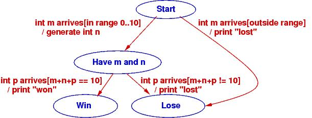
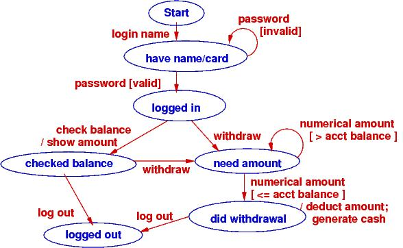
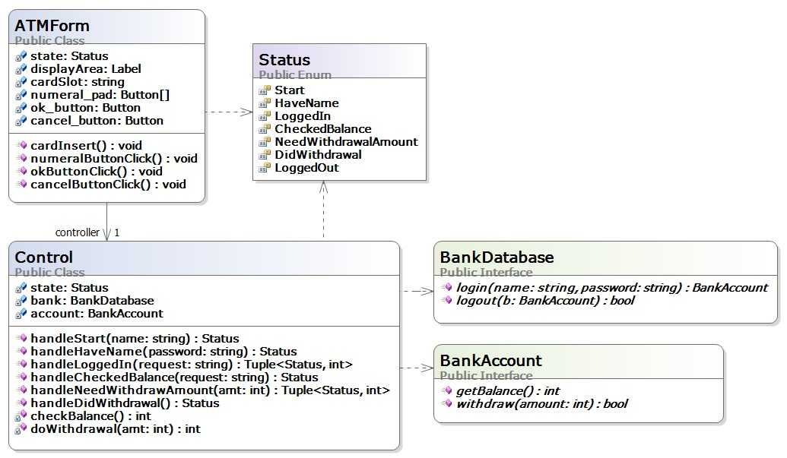

.. _state-diagrams:

State diagrams for programming controllers
##########################################

A controller holds an algorithm or protocol.
A controller's methods hold steps of the algorithm/protocol.
In a reactive system, the steps (methods) of the algorithm are executed one at
a time, in response to input events.

* We must design the controller so that the steps are executed in correct order.

* We must design the controller so that it remembers the current stage of
  execution when it is time to do another step.

When you have an algorithm that gets divided into stages, due to input events,
then use a state diagram to document the stages and define the methods that the
controller will need.

Example: Number Game
********************

At the beginning of the course, we did a little exercise like this::

    Use Visual Studio to code a console app and then to code a Forms app for the following game:

       "Guess an int, M, in range 0..10:  M = "
       (User types int, m)
       "I, the computer, guess this int, N, in range  0..10-M: N = (Computer randomly gens  n)
       "Now you type an int, P, such that M + N + P = 10:  P = "
       (User types int, p)
       "You win!" or "You lose!" (depending on how the ints total)

We have this use-case realization (algorithm):

1. *"Guess an int, M, in range 0..10:" (User types int, m)*::

       Input int m is checked to see if it is in range, 0..10.
       If  yes, int  n  is randomly generated for display:

2. *"Computer guesses this int, N = n. Now you guess P such that M + N + P = 10:"
   (User types int, p)*::
   
       Input int  p  is added to  m  and  n  to see if the sum is 10.
       The result is displayed:

3. *"You win!" or "You lose!" (depending on how the ints total)*

If we implement the game as a console application, the ``Console`` is the "View"
that receives input and displays output, and the console app's ``Main`` method
is the controller that implements the realization:

.. code-block:: c#

   static void Main() {
     // Step 1:
     Console.Write("Guess an int, M, in range 0..10: ");
     int m = int.Parse(Console.ReadLine());
     if (m >= 0 && m <= 10) {
       int n = (new Random()).Next(0, 10 - m);
       // Step 2:
       Console.Write("Computer guesses this int, N = {0}.\nNow you guess P such that M + N + P = 10: ", n);
       int p = int.Parse(Console.ReadLine());
       // Step 3:
       if (m + n + p == 10) { Console.WriteLine("You win!"); }
       else { Console.WriteLine("You lose!"); }
     }
     else { Console.WriteLine("You lose!"); }
     Console.ReadLine();  // retain command window till user presses Enter 
   }

The algorithm is a simple "straight-line" sequence --- beginner stuff.

If the game is implemented as a Forms app (reactive system),
there is a View (Form), a Controller, and more work, 
*because the game is split into two stages*:

* Stage 1, triggered by int ``m`` and a button press in the View, signals the
  Controller to check ``m``, generate ``n``, and return ``n`` to the View for
  display.

* Stage 2, triggered by int ``p`` and a second button press in the View
  (the same button? a different button?), signals the Controller to retrieve
  ``m`` and ``n``; add ``m``, ``n``, and ``p``; and return the result to the
  View for display.

*The straight-line code must be chopped into pieces.* )-:

There is a special diagram that we draw to list the stages a controller must
traverse when computing the algorithm in a reactive system --- a state diagram.
For complex controllers, a state diagram is a critical part of the design that
you do before you code the controller.

We reformat the use-case realizations as this state diagram:

The states are the blue ellipses.
The labels on the arcs have form, ``event [condition] / action``.
The ``event`` is the external, input event that triggers computation.
The ``condition`` must be true for the arc to move to the next state in the
computation (this is a way of remembering where ``if`` commands are needed), and
the action describes the computation to do if the condition is true.

The state diagram shows how the game moves from its start state on an input
event ("int ``m`` arrives") to a state where two ints are known.
At this point, a second input event transitions to an end state.

The Controller implements the state diagram via a handler method that is called
when a button is pressed.
Here is how we might code it, using the states of the state diagram as data
values:

.. code-block:: c#

   // states of the number-guessing game
   public enum Status { Start, HaveMN, Win, Lose };

   // controller for number-guessing game
   public class GameController {
     private int m;                        // user's initial guess
     private int n = -1;                   // the randomly generated response
     private Status state = Status.Start;  // how far the algorithm has progressed 

     // handle  executes the next step of the game based on the current state
     // param:  s is a string representing an int
     // returns:  a tuple holding  (the new state of the game, an int to be displayed)
     public Tuple handle(string s) {
       switch (state) {  // check current state to decide what to do:
         case Status.Start: {   // start of game: s is a user-supplied int
           bool intOK = int.TryParse(s, out m);
           if (intOK && m >= 0 && m <= 10) {
             n = (new Random()).Next(0, 10 - m);  // generate random int
             state = Status.HaveMN;
           }
           else { state = Status.Lose; }
           break;
         }
         case Status.HaveMN: {  // middle of game: s is user's second int guess
           int p;
           bool intOK = int.TryParse(s, out p);
           if (intOK && (m + n + p == 10)) { state = Status.Win; }
           else { state = Status.Lose; }
           break;
         }
         default: {  // game is over and state is  Status.Win or Status.Lose
           break; 
         }
       }
       return new Tuple(state, n);
     }
   }

The ``Status`` of the game (``Start``, ``HaveMN``, ``Win``, ``Lose``) is defined
by a C# enumeration; the values came from the state diagram.
Variable ``state`` is called a *state variable* because it remembers the
"state of the game."
*The state variable helps the controller enforce the game's protocol (steps of
its algorithm) in the correct order.*

Notice that ``handle`` returns a pair (``Tuple``) that holds the new state of
the game and an int to be displayed.
The View object (Form) uses this information to select the correct message to
display.
That is, the View also uses enumeration ``Status`` to track the progress of
the game.
By the way, here is how a pair is disassembled in C#:

.. code-block:: c#

   GameController c = new GameController(...);
   // ...
   Tuple pair = c.handle(mytextbox.Text);
   Status state = pair.Item1;
   int data = pair.Item2;
   // ...

Now, *match the code in method* ``handle`` *to the code in method* ``main``.
The former is easier to read, but the latter is what we are forced to write when
we build a reactive system.
State diagrams help us do the latter.

As an exercise, you should write a ``class GameForm``, a Form with a Textbox and
a single Button, that calls ``GameController``'s ``handle`` method and uses the
information that is returned to refresh the display and tell the human player
what to do next.

It is also possible to code the state diagram as multiple methods,
one for each state in the diagram.
Here's what the controller would look like:

.. code-block:: c#

   public class GameController {
     private int m;                        // user's initial guess
     private int n = -1;                   // the randomly generated response
     private Status state = Status.Start;  // how far the algorithm has progressed

     // handleStart  checks initial guess and generates a random response int.
     // precondition: game is in Start state
     // param:  s is a string representing an int
     // returns: a tuple holding   (the state of the game, a random int)
     public Tuple handleStart(string s) {
       bool intOK = int.TryParse(s, out m);
       if (intOK && state == Status.Start && m >= 0 && m <= 10) {
         n = (new Random()).Next(0, 10 - m);  // generate random int
         state = Status.HaveMN;
       }
       else { state = Status.Lose; }
       return new Tuple(state, n);
     }

     // handleMN  checks final guess and computes outcome.
     // precondition: game is at  HaveMN  state
     // param:  s  is a string representing an int
     // returns: state of the game (is either Lose or Win)
     public Status handleMN(string s) {
       int p;
       bool intOK = int.TryParse(s, out p);
       if (intOK && state == Status.HaveMN && (m + n + p == 10)) {
         state = Status.Win;
       }
       else { state = Status.Lose; }
       return state;
     }

     // handleWin  does nothing --- the game is over
     // precondition: game is at  Win  state
     // returns: state of the game
     public Status handleWin() {
       if (state != Status.Win ) { state = Status.Lose; }
       return state; 
     }

     // handleLose  does nothing --- the game is over
     // precondition: game is at  Lose  state
     // returns: state of the game
     public Status handleLose() {
       state = Status.Lose;
       return state;
     }
   }

The above coding might be used when the View form has multiple buttons that
can call distinct handlers.
The View form would use its own state variable to remember the status of the
game and to enable the appropriate button(s).

To summarize,

* State diagrams are critical to designing controllers in complex reactive
  systems: input data arrives in bits, in stages, and the controller must
  collect the data and remember how much progress is accomplished in the
  computation, the transaction.
  The state diagram documents how the controller will be programmed.

* State diagrams are also useful for coding views (input forms) in reactive
  systems: as the user interacts with the view, some of the view's elements may
  appear/disappear, enable/disable.
  The state diagram documents how the view will be programmed to display and
  enable its widgets.
  The controller computes and returns the current state to the view, which uses
  it to update its presentation.

Example: ATM protocol
*********************

When you login to a web form or an ATM, you do it in stages: you provide a login
name (it's on the magnetic strip or chip of your bank card), which is verified,
you provide a password (PIN), which is verified, then you are shown a menu of
options, of which you select one, and that leads you to more options that you
follow to complete a transaction.
Like the number game above, there are stages that must be completed for the 
transation.
Use-case realizations help you list all the operations.
From the realizations, you generate one big state diagram that lists the
protocol/algorithm for the ATM's controller:

It is almost a mechanical process to define the controller's fields, methods,
and even the methods' codings from the state diagram.
Here is what we might design if we write multiple handler methods from the
diagram:

A State Diagram Defines An Input Language
*****************************************

You type instructions in C# to tell a computer what to do.
C# is a language that instructs the computer.
When you use a reactive tool to tell the computer what to do,
your key presses and mouse clicks define a "baby language" that instructs
the computer.

The event-protocol for a system defines a programming language,
an "input language."

A state diagram lists the events that cause the controller to move from one
computational state to the next.
The paths through the state diagram list event sequences.
Each event sequence along a path defines an input program.

When you take a course on language theory, you will learn that a state diagram
defines a *finite-state automaton* and the paths define a *regular language*.

Reconsider the two examples seen above. Here are the langauges they define:

* *Number game*: The input language consists of just these two event sequences,
  these two "programs"::
  
      m arrives   p arrives
      m arrives
      
  The specific values of ints ``m`` and ``p`` generate differing outputs, but
  there are just two legal sequences that one uses with the game.
  So, we build a GUI with a button and textbox so that the human can "write"
  these "programs", which are sent to the controller that implements the state
  diagram.

* Bank ATM: There are many (indeed, infinitely many) distinct input programs for
  the ATM. Here are three examples::
  
      login name   password   check balance   logout
      login name   password   password   withdraw   amount   logout
      login name   password   check balance   withdraw   amount   amount   logout

  The second and third examples show that a password and then a withdrawal
  amount were reentered due to errors.

  We can write a *regular expresion* (an "and-then"/or"/"repeat") expression to
  define precisely the ATM's input language::

      login name 
        password+ 
          ( check balance  ( logout  |  (withdraw  amount+  logout ))
          | withdraw  amount+  logout )
  
  The ``|`` means "or" and the ``+`` means "repeat one or more times".
  You read it like this:
  "An input program starts with ``login name`` followed by one or more 
  ``password`` s followed by *either* ``check balance`` followed by ... *or*
  ``withdraw`` followed by one or more ``amount`` s then ``logout``."

State diagrams define regular languages, which are formalized by regular
expressions.

State diagrams cannot define all languages.
Languages like English and C# have nested, internal structure.
(Think about how assignments are nested in loops, which are nested in methods,
which are nested in....)

In particular, languages that used nested, matching brackets cannot be defined
by a state diagram.
A simple and good example is arithmetic, where the user submits/writes a
nested expression, bracketed with parentheses, e.g., ``( ( 3 + 2 ) * 4 )``.

Treat the symbols, ``(``, ``(``, ``3``, ``+``, etc., as "events" that trigger 
computation. 
*A state diagram, by itself, cannot define the algorithm for reading and
computing the arithmetic expression.*

"Nested languages" are called *context-free languages*, and their computations
are defined by *attributed grammar rules*.
Here is the attributed grammar that defines how to compute an arithmetic program
to its output, its *meaning*::

    Syntax (format of "event sequences"):
    -------------------------------------
    EXPRESSION ::=  NUMERAL  |  ( EXPRESSION1 OPERATOR EXPRESSION2 )
    OPERATOR ::=  +  |  -  |  *
    NUMERAL ::=  0  |  1  |  2  |  ...  |  9

    Semantic attributes ("actions" triggered by events):
    --------------------------------------------
    meaningOfNUMERAL[ 0 ] =  zero
    meaningOfNUMERAL[ 1 ] =  one
    meaningOfNUMERAL[ 2 ] =  two
     ...
    meaningOfNUMERAL[ 9 ] =  nine

    meaningOfOPERATOR[ + ] =  add,  where  add(m,n){ return m+n }
    meaningOfOPERATOR[ - ] =  sub,  where  sub(m,n){ return m-n }
    meaningOfOPERATOR[ * ] =  mult, where  mult(m,n){ return m*n }

    meaningOfEXPRESSION[ NUMERAL ] =  meaningOfNUMERAL[ NUMERAL ]
    meaningOfEXPRESSION[ ( EXPRESSION1 OPERATOR EXPRESSION2 ) ] =  meaningOfOPERATOR[ OPERATOR ]( meaningOfEXPRESSION[ EXPRESSION1 ], meaningOfEXPRESSION[ EXPRESSION2 ]) 

An example:

* The "event sequence" defined by ``( ( 3 + 2 ) * 4 )`` is this nested,
  tree structure:

  .. image:: tree1.jpg

* and the actions/meaning generated by the tree is this:

  .. image:: tree2.jpg  

Both the "event sequences" and the actions are nested in recurrence-equation
style.
(The event sequences are trees, called *parse trees*.)
There are automated tools, called *parser generators*, that convert definitions
like the one above into code.
The C# compiler converts your C# program into a parse tree and then computes the
tree's meaning --- an ``.exe``-file that computes your program's output.

We will not study context-free languages here; you will see them if you take 
CIS505.
There are also context-sensitive languages and unrestricted (Turing machine)
languages.

----

.. raw:: html

   
<small><em>
   This note was adapted from David Schmidt's CIS 501, Spring 2014, 
   <a href="http://people.cis.ksu.edu/~schmidt/501s14/Lectures/Lecture08S.html">Lecture 8</a>
   course note. © Copyright 2014, David Schmidt.
   </em></small>

