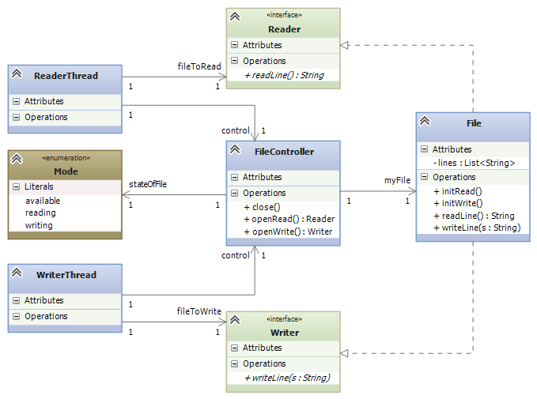

.. raw:: html

    
   
   <big><big><b>
   
Course Notes --- CIS 501: Software Architecture and Design, Fall 2014

.. raw:: html

   </b></big></big>
   

.. _design-patterns-prelude:

Design Patterns Prelude: Interfaces and Delegates
#################################################

In object-oriented programming, a *design pattern* is a solution scheme to a
common architectural problem.

The text,
`Design Patterns: Elements of Reusable Object-Oriented Software <http://www.amazon.com/Design-Patterns-Elements-Reusable-Object-Oriented/dp/0201633612>`__
by E. Gamma et al., Addison-Wesley 1994, is a famous text that popularized
design patterns.
Experienced programmers know most or all of the 23 patterns described in that
text.

Over the next few weeks, we will study about 8-10 patterns from the Gamma book.
(Many people call the text the "Gang of Four" book, because the book has four
authors.)
The patterns are also documented in 
`Dr. Mizuno <http://people.cis.ksu.edu/~masaaki/>`__'s CIS501 lecture notes.
(Ask him where to buy a copy.)

The 
`Wikipedia page on design patterns <http://en.wikipedia.org/wiki/Software_design_pattern>`__
has a nice summary of the patterns in the Gamma book.

Design patterns are important to know, not only because they define important
"programming tricks", but because they define a "language" that software
engineers use when they describe their systems to their colleagues (e.g.,
"In my subassembly, I used an Observer Pattern to update the views of my model".)

Interfaces and delegates
************************

Most design patterns use interfaces and delegates.
We should review how these are used before we study any design patterns.

*Interfaces* are used in these ways:

* Many systems are first designed from classes only.
  But if several people or teams are coding the system, then the system should
  be divided into subassemblies --- interfaces let us break the design into
  subassemblies that can be developed in parallel.

* Sometimes a subassembly is coded and saved in a library for later use (e.g.,
  the components for GUI-building, or .NET's general-purpose dictionary
  collection, or the back-end database of a server).
  An interface can be defined as the "entry point" into the subassembly.

* If there are multiple components that are meant to be interchangeable,
  they should be defined so that each implements one and the same interface.
  (We saw an example with the ``class Human`` and ``class Android`` card
  players, which are meant to be interchangeable and both implement
  ``interface Player``.)

* When a class has more methods coded in it than what are needed, we can hide
  the unneeded ones behind an interface.

All these examples are illustrated below.

A *delegate* can be considered an "interface" where there is exactly one
method, so we don't need to connect to a class that holds the method --- we just
connect to the method directly.
In C, this is called a "function pointer"; in other languages (Lisp, Scheme, ML,
Haskell, Python, Ruby, Scala), it is called a "closure".

Here are reasons to use delegates:

* As just noted, when one needs a connection point that is a single method,
  rather than an object that holds methods, use a delegate.

* When two assemblies are written in completely different languages and execute
  on incompatible platforms, one way of connecting them is via function
  calls (e.g., "RPC" --- Remote Procedure Call).
  A delegate specifies the argument-answer structure of such a function call.

* When two classes' methods call each other (that is, their links form a cycle),
  the design is likely flawed.
  Rather than merge the two classes into one, which will induce poor cohesion,
  we use a delegate to break the cycle.

* When a method needs a parameter that is itself a method, the type of the
  parameter is defined by a delegate.

Examples follow.

Inserting Interfaces
********************

Defining Subassemblies
======================

Many systems are first designed from classes only.
But if several people or teams are coding the system, then the system should be
divided into subassemblies --- interfaces let us break the design into
subassemblies that can be developed in at the same time, even at different paces.

Interface insertion goes like this. Say we have a design like:

.. image:: start1.png

and we wish to "cut" the design into two subassemblies, one holding ``class C``
and the other holding ``D`` and ``E``.
We insert an interface that lists the names of the methods in ``class D`` that
are called by the code in ``class C``:

Now, one team builds a VS Project consisting of ``class C`` and ``interface ID``.
The project can be written and unit tested.
(We might write a simplistic "dummy class" that implements ``ID`` for the
testing.
At the same time, another team builds a VS Project consisting of ``class D``, 
``class E``, and ``interface ID``, such that ``public class D : ID``, that is, 
``C`` *implements* ``ID``.
That project is also written and tested.
Later, we assemble the two projects and do "integration testing."

Here is a concrete example of the technique: In the notes for state diagrams,
we saw an example where an ATM subassembly was developed.
The subassembly is supposed to link to the bank's database, but it was not our
job to design the database or *even know what it will be*.
So, the subassembly is built to connect to interfaces to the bank's database
like this:

.. image:: bank0.png

Later, the bank's database and its accounts plug-into (implement) the two
interfaces.
In the meantime, we test the subassembly with dummy classes ("stubs"), such as:

.. code-block:: c#

   public class DummyDatabase : BankDatabase {
     private BankAccount a = new DummyAccount();
     public BankAccount login(string name, string password) { return a; }
     public bool logout(BankAccount b) { return b == a; }
   }
   public class DummyAccount : BankAccount {
     private int balance = 100;
     public int getBalance() { return balance; }
     public bool withdraw(int amount) {
       if (amount > balance ) { return false; }
       else { balance = balance - amount;  return true; }
     }
   }
   
Making An Entry Point Into A Library Assembly
=============================================

Sometimes a subassembly is coded and saved in a library for later use (e.g.,
the components for GUI-building, or .NET's general-purpose dictionary collection,
or the back-end database of a server).
An interface can be defined as the "entry point" into the subassembly.

Look at the previous diagram --- the two interfaces used by the ATM assembly are
"entry points" into a complex collection of classes that implement a database.
There is no way that the authors of the ATM assembly want to read all the
database's classes and code, so the two interfaces, ``BankDatabase`` and 
``BankAccount``, act as simple entry points into the database assembly.
The two interfaces, along with many other interfaces (for other means of entry)
are included in the library of database components.

Such interfaces are sometimes called *API* s (Application Programming Interfaces).
.NET uses lots of APIs to suggest ways that you can connect to their libraries.

Interchanging Components
========================

If there are multiple components that are meant to be interchangeable,
they should be defined so that each implements one and the same interface.
The general idea looks like this:

.. image:: start2.png

The interface provides an opportunity to "unplug" ``class D`` from the system
and replace it with a (better or new-and-improved) alternative, 
``class Dalternative``.
Interfaces are often introduced into systems where there are several candidates
for "plugging into" the system.

We saw an example early in the notes with the card game, where ``class Human``
and ``class Android`` are meant to be interchangeable and both implement
``interface Player``:

Here's the code for the interface, the two forms of ``Player``, and 
a generalized ``Dealer``:

.. code-block:: c#

   // a Player is any class that has these two methods with
   // the behaviors described in the comments:
   public interface Player {
     // wantsCard returns true when the Player wants another card:
     public bool wantsCard();
     // getsCard(c) adds Card c to the hand held within the Player:
     public void getsCard(Card c);
   }

   // HumanPlayer is the computerized "proxy" for the human;
   // it _implements_ (matches) interface Player:
   public class HumanPlayer : Player {  // READ THIS LINE CAREFULLY!
     private HandOfCards h;
     // ... other fields

     public bool wantsCard() {
       Console.WriteLine("Do you want another card?");
       string answer = Console.ReadLine();
       return (answer == "Yes");
     }
     public void getsCard(Card c) { h.add(c); }

     // ... other methods
   }

   // ComputerPlayer is a computer card player; it also implements Player:
   public class ComputerPlayer : Player {
     private HandOfCards h;
     ... // other fields

     public bool wantsCard() {
       return (h.score() < 17)
     }
     public void getsCard(Card c) { h.add(c); }

     // ... other methods
   }

   // dealer for a card game of Players:
   public class Dealer {  
     private List<Player> players;          // the players of the game
        // we use the interface name as the "data type" of the players
  
     private CardDeck d;     // the deck of cards

     // construct dealer:  pl  is a list of the Player objects
     //   that the dealer contacts
     public Dealer(List<Player> pl) {  players = pl; }

     // plays one round of the card game with the  players:
     public void PlayOneRound() {
       // ...
       foreach(Player p in players) {
         while (p.wantsCard()) {
           p.getsCard(d.dealNewCard())
         }
       }
       // ...
     }
   }
   
Hiding Methods
==============

When a class has more methods coded in it than what are needed, we hide the
unneeded ones behind an interface.
Sometimes this is critical to ensure correct operation of a system.
Here's a concrete example: Say that a file is shared between a reader thread and
a writer thread --- the reader wants only to read the lines of the file, and
the writer wants only to write lines to the file.
But the file object has methods for both reading and writing!

To ensure that at most one thread can use the file at any time, and to ensure
that the thread uses exactly the methods on the file that it requests to use,
we introduce a controller class along with two interfaces that expose only the
proper method(s) to each thread:

So, a ``ReaderThread`` asks the ``FileController`` for permission to read the
``File`` object, and the controller returns a handle to a ``Reader`` -typed
object, so that only the object's ``readLine`` method is available.
In this way, the reader thread cannot abuse the file by calling ``writeLine``.
The same technique is used for the ``WriterThread``.

Inserting Delegates
*******************

Connecting Two Assemblies via An Individual Method, Not via A Class
===================================================================

In the previous example, the reader and writer threads used a file *object*,
which they connected to via an interface of just one method.
This makes sense, because a reader knows that it has a handle to a file object,
but it plans only to read lines from the file. (Similar for the writer.)

Sometimes, an assembly will connect to another assembly and the first assembly
does not know exactly what it is connecting to, and it does not care!
If the connection is merely a method name, and the connection is merely a method
call with arguments, then a delegate makes perfect sense to use.

This situation happens a lot with graphics forms --- a graphic form collects
some input data, which it sends forward for computation.
The graphics form does not care if it talks to an "object" --- it just wants to
send the data.
On the other end of the communication, the controller object is waiting for data
to process, and it does not care if it receives the data from a GUI object, or
via some other device/method.
This situation is well suited for a delegate construction:

The delegate is critical when the graphics forms are written in a separate,
custom language/tool that is incompatible with the language/tool that the
controller uses.
The only way of connecting the graphics to the controller is via function call
(e.g., "RPC" --- Remote Procedure Call).
A delegate specifies the argument-answer structure of such a function call.
Each assembly includes the delegate in its coding, ensuring that the two systems
will communicate correctly.

Breaking An Architectural Cycle
===============================

When two classes' methods call each other (that is, their links form a cycle),
the design is likely flawed.
Rather than merge the two classes into one, which will induce poor cohesion,
we use a delegate to break the cycle.

In object-oriented programming, we might encounter a sequence of method calls
like this:

1. A ``Client`` object calls a ``Manager`` object and asks for help to do work.

2. The ``Manager`` "opens" or "activates" a ``Helper`` object to do the work.

3. The ``Helper`` object's methods are called by the ``Client`` and do the work.

4. The ``Helper`` object is told (or it determines on its own) that its work is
   finished, so it *calls back* the ``Manager`` to tell it to "close" or
   "deactivate".

This sequence can happen when a file object is opened, repeatedly read, and then
closed.
It also appears when a GUI Form calls a controller to do computation and then
the controller calls the GUI back to tell it to refresh its display.
And it happens when a data structure is told to update itself and then notify
its "observer" Forms.

Here is a diagram that matches the above story,
Steps 1-4: The ``Manager``'s ``requestHelp()`` method constructs a ``Helper``
that the ``Client`` calls to ``doWork()``.
When the ``Client`` is happy, it tells the ``Helper`` that it is ``finished()``
with it.
The ``Helper`` calls back the ``Manager``'s ``remove()`` method, which causes
the ``Helper`` object to be "deactivated" (and garbage-collected).

.. image:: start3.png

The cycle between ``Manager`` and ``Helper`` is awkward, and it exists only
because the ``Helper`` must call the remove method at the end of its life.
Admittedly, we might eliminate the cycle by making the ``Client`` call
``mgr.remove(h)``, but the call is not always natural for the ``Client`` to make.

Another solution for both ``Client`` and ``Manager`` is to use a delegate
declaration so that the ``Helper`` is initialized with the method it should call
when it is done with its work:

.. image:: start4.png

Making Methods Arguments To Methods
===================================

When a method needs a parameter that is *itself* a method, the type of the
parameter is defined by a delegate.
Here is an example: Say that we work a lot with arrays of ints, and we find that
we are doing standard operations on the elements of the arrays --- squaring
each element, adding one to each element, replacing each element by zero, and
so on. It is tedious to write this kind of code:

.. code-block:: c#

   public void squareAll(int[] r) {
     for(int i = 0; i < r.Length; i++) {
       r[i] = r[i] * r[i];
     }
   }

   public void incrementAll(int[] r) {
     for(int i = 0; i < r.Length; i++) {
       r[i] = r[i] + 1;
     }
   }

   public void zeroAll(int[] r) {
     for(int i = 0; i < r.Length; i++) {
       r[i] = 0;
     }
   }

There is one underlying idea, that of performing an operation, ``f``, on each
element of the array.
We define ``f`` as a delegate and write this useful tool, named ``mapAll``:

.. code-block:: c#

   delegate int ElementOp(int n);

   public void mapAll(int[] r, ElementOp f) {
     for (int i = 0; i < r.Length; i++) {
       r[i] = f(r[i]);
     }
   }

Method ``mapAll`` defines the pattern of applying an operation to each element
of an array.
Now, when we have some operation, e.g.,

.. code-block:: c#

   public int square(int n) { return n * n; }

We use it with ``mapAll`` like this: ``mapAll(r, square)``. 
Note: in C#, it is possible to do the previous line without naming method 
``square``; instead, we place the code body for square in the position of the 
second argument for ``mapAll`` as follows:

.. code-block:: c#

   mapAll(r, n => n * n);

================

.. raw:: html

   
<small><em>
   This note was adapted from David Schmidt's CIS 501, Spring 2014, 
   <a href="http://people.cis.ksu.edu/~schmidt/501s14/Lectures/DP0S.html">Lecture 10</a>
   course note. © Copyright 2014, David Schmidt.
   </em></small>

