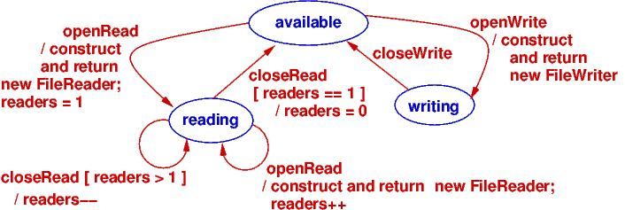
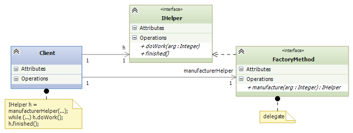
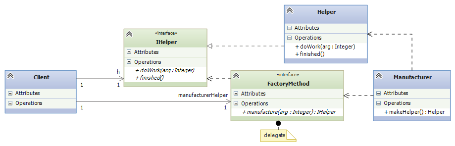

.. raw:: html

    
   
   <big><big><b>
   
Course Notes --- CIS 501: Software Architecture and Design, Fall 2014

.. raw:: html

   </b></big></big>
   

.. _design-patterns-factories-iterators:

Design Patterns I: Factories and Iterators
##########################################

Factory Method
**************

A method that returns as its answer the handle to a newly constructed object is
called a *factory method* --- the method "manufactures" an object each time it is
called.
We saw an example in the previous lecture in the ``Manager``/``Helper`` example.

Here is an example that we will develop in detail.
We did a VS exercise where two threads of execution shared a "file" for reading
and writing.
The controller was supposed to ensure that the file was never simultaneously
used for both reading and writing. The example was structured like this:

.. image:: fm0.png

The code in ``FileController`` remembered whether the ``File`` was being used
for reading or writing.

The above architecture is limited to at most one ``ReaderThread`` doing reading
at a time.
But it is safe for multiple threads to read the same file simultaneously, and
the threads can even read at different rates of speed, since no thread changes
the file.
We should modify the above design so that it allows multiple reader threads.

The solution is for the controller to manufacture, for each reader thread,
an object that remembers the handle to the file object and the progress of
reading.
We use a *factory method*, ``makeReader``, to manufacture ``FileReader`` objects:

When a ``ReaderThread`` wants to read the file, it calls the
``FileController``'s ``openRead()`` method, which checks if the file's ``status``
is ``available`` or ``reading``.
In these cases, the ``status`` is set to ``reading`` and ``f.makeReader()``
*manufactures a* ``FileReader`` *object*.
The ``FileReader`` object's handle is returned to the ``ReaderThread``, which
calls the object's ``read`` method to read the file's lines.
(The ``FileReader`` object holds a ``count`` of how far the file has been read.)
We will study the ``close`` method in a bit.

``makeReader`` is a factory method --- it manufactures ``FileReader`` s.

When there are multiple ``ReaderThread`` s, each one calls ``openRead()`` and
receives its own ``FileReader`` for reading the shared file.

The ``FileController`` is programmed to allow a ``WriterThread`` to write to the
file only when the file's ``status`` is ``available``.
(Then, the status is set to ``writing``, and the file can be written.)

This state diagram defines the protocol enforced by the ``FileController``:

In the previous class diagram, notice the delegate, ``CloseOp`` --- it is used
to solve a technical problem: the ``FileController`` must be told when a 
``ReaderThread`` is finished reading from its ``FileReader`` object.
So, when the ``FileReader`` object is constructed, a handle to
``FileController``'s private method, ``closeRead``, is embedded within the
``FileReader``.
When the ``ReaderThread`` calls ``close()`` in the ``FileReader``,
this activates a call to ``closeRead()``, too!

.. commented out

   Here are the relevant classes; study the factory methods, ``makeReader`` and
   ``makeWriter``, and the use of ``CloseOp`` to force a call to ``closeRead``
   within the ``close`` method of ``FileReader``.

.. commented out code-block:: c#

   // type of method that tells the controller that file has been closed:
   public delegate void CloseOp;

   // defines the controller's state:
   public enum Mode {Available, Read, Write};

   // controls access to a TextFile object
   public class FileController { 
     private Mode status;       // the current mode of use of the file
     private TextFile thefile;  // the data structure controlled
     private int readers;       // number of active readers of this file

     public FileController(TextFile f) {
       thefile = f;  readers = 0;  status = Mode.Available; 
     }

     // opens file for read use; allows multiple readers of the file.  
     // returns handle to FileReader object (returns null if cannot construct)
     public FileReader openRead() {
       lock(this){
         FileReader ans = null;
         if (status == Mode.Available || status == Mode.Read) {
           status = Mode.Read;
           readers = readers + 1;
           ans = thefile.makeReader(this.closeRead);  // call factory method
         }
         return ans;
       }
     }
     
     // closes file and resets mode to Mode.Available if no more readers
     private void closeRead() {
       lock(this){
         readers = readers - 1;
         if (readers == 0 ) {
           status = Mode.Available;
         }
       }
     }

     // opens file for write use; returns handle to FileWriter (returns null if not allocated)
     public FileWriter openWrite() {
       lock (this) {
         FileWriter ans = null;
         if (status == Mode.Available) {
           status = Mode.Write;
           ans = thefile.makeWriter(closeWrite); // call factory method
         }
         return ans;
       }
     }

     // closes file and resets mode to Mode.Available
     private void closeWrite() {
       lock (this) {
         status = Mode.Available;
       }
     }
   }

   // models a textfile (as a sequence of lines/strings)
   public class TextFile {
     private List contents;  // the file

     public TextFile() { this.reset(); }

     // empties the file for writing:
     public void reset() { contents = new List(); }

     // reads line  i  in the file.  Returns (line #i) if ok;
     // Returns  null  if  i  is out of bounds.
     public string readAt(int i) {
       string line = null;
       if (0 <= i && i < contents.Count) {
         line = contents.ElementAt(i);
       }
       return line;
     }

     // adds line  s  to the end of the file:
     public void write(string s) { contents.Add(s); }

     // factory method to manufacture a helper reader object,
     // where  c  is the method to call when reading is finished
     public FileReader makeReader(CloseOp c) {
       return new FileReader(this, c);
     }

     // factory method to manufacture a helper writer object,
     // where  c  is the method to call when writing is finished
     public FileWriter makeWriter(CloseOp c) {
       return new FileWriter(this, c);
     }
   }

   // Iterator object generated to help read a file
   public class FileReader {
     private TextFile f;         // handle to the file to be read
     private int count;          // how many lines in file have been read
     private CloseOp closefile;  // method to call when finished reading

     public FileReader(TextFile f, CloseOp c) {
       this.f = f; count = 0;  closefile = c;
     }

     // checks and returns if the file has more lines to read
     public bool more() {
       bool ans = false;
       if (f != null ) {
         ans = (f.readAt(count) == null);
       }
       return ans;
     }

     // reads and returns next line of the file; if file all read, returns null
     public string read() {
       string line = null;
       if (f != null) {
         line = f.readAt(count);
         count = count + 1;
       }
       return line;
     }

     // closes file once reading finished
     public void close() {
       if (f != null) { closefile(); }  // call cleanup method in controller
       f = null;  // disconnect from the file
     }
   }

   // FileWriter is similar....

The Factory Method Design Pattern
=================================

If you study the *Design Patterns* book, you will see a difference between
a factory method (as illustrated above) and the design pattern that uses
a factory method.

The *factory method design pattern* states that the connection between
a ``Client`` (like the ``ReaderThread``) and the factory method
(like ``makeReader``) that constructs ``Helper`` objects (like the
``FileReader`` objects) should be defined with interfaces and delegates,
say like this:

The pattern shows that the ``Client`` does not need to know how the helper
objects are constructed.
The delegate and interface are implemented by the factory method (which is coded
inside some class, ``Manufacturer``) and the class of ``Helper``:

Indeed, the two classes can be one and the same:

.. image:: FacMeth3.png

The factory method design pattern states that the ``Client`` can be happily
ignorant of the details of manufacuring helpers.

Iterator
********

In the above example, the ``FileReader``'s ``read`` method counts the file's
lines, meaning that the ``ReaderThread`` and the ``FileController`` do not do
the counting.

An object that "counts through" the elements of a collection is called an
*iterator object*.
In the above example, each ``FileReader`` object is an iterator for the
``TextFile`` object.

An iterator object has a method that returns the next item in a collection and
a method that asks if there are any more items left to be returned.
For ``TextFile``, these are the ``read`` and ``more`` methods.
Using an iterator object, we write a standard loop that reads all the file's
lines and uses them:

.. code-block:: c#

   FileReader r = controller.openRead();
   if (r != null) {  // OK to read?
     while (r.more()) {  // reading lines from file, one at a time:
       string s = r.read();
       Console.WriteLine(s);
     }
   }

That's it!

The previous example looks like the iterator objects used in Java, where
we collect some ``Item`` objects in a collection, ``ItemAggregate``:

(Note: interfaces are often inserted between the ``Client`` and the 
``Iterator``, like we saw at the end of the previous section.
There is a good reason for this --- see below.)

Look again at the ``FileReader`` example: the "ItemAggregate" is class 
``TextFile``, which holds string "Items".
``Class FileReader`` is the "Iterator", and ``readLine`` is the "next" method.

The Iterator Design Pattern is important because every system uses
a data structure or database, and every system must read and process all the
elements of the data structure.
The data structure might be a list or a table or a tree or a graph, and 
each of these structures have distinct traversal algorithms.
*By using the iterator design pattern, we hide the traversal algorithm from the
code that reads and processes all the elements in the data structure.*

The previous example looks like the iterator objects used in Java.
In the C# .NET library, there is an interface, ``IEnumerable``, that defines
how you are supposed to code an interator class in C#.
The method names are a little different and work slightly differently:

.. code-block:: c#

   public interface IEnumerable {
     // moves to the next element in the collection and makes it Current;
     // returns true if successful;  returns false if there is no next element.
     public bool MoveNext(); 

     // resets the counting to the front of the collection:
     public void Reset();

     // returns the value of the current element in the collection:
     object IEnumerator.Current;
   }

You are also supposed to write a factory method, ``GetEnumerator()``, which
constructs the iterator object.
The C# compiler lets you use objects that implement
the ``IEnumerable`` interface with a ``foreach`` loop.
Indeed, a ``foreach`` loop like this one:

.. code-block:: c#

   MyCollection collection = ... ;
   foreach (C c in collection) {
     ... c ...
   }

is reformatted by the C# compiler into this while loop that uses the iterator
object:

.. code-block:: c#

   IEnumerable iterator = collection.GetEnumerator();
   iterator.Reset();
   while (iterator.MoveNext()) {
     C c =  (C)(iterator.Current);
     ... c ...
   }

Whenever you define a data structure in C# that holds a collection of objects
--- a matrix, a tree, a linked list, etc. --- you should define an iterator that
can traverse the structure and enumerate the objects.
Then you use the ``foreach`` loop to process the data structure.

Summary
=======

Masaaki Mizuno's CIS501 notes has this good example of the iterator pattern:

.. image:: mmit1.jpg

.. image:: mmit3.jpg

.. image:: mmit4.jpg

Singleton Class
***************

In the previous example, ``class FileReader`` does the work of reading the file;
this simplifies ``class FileController`` and makes possible multiple active 
``FileReader`` s.
``class FileWriter`` works the same way, but *there should be at most one object
constructed from* ``class FileWriter`` *at any one time*.
A class from which we build exactly one object is a *singleton class*.

Here is ``class FileWriter``, rewritten so that only one object is ever
constructed from it. (The key is the ``private`` constructor method!)

.. code-block:: c#

   // constructs a single object for writing to a text file (list of strings)
   public class FileWriter
     // IMPORTANT: holds the handle to the "singleton" FileWriter object:
     private static FileWriter writerOb = new FileWriter();

     private static bool inUse;  // remembers if  writerOb  is being used
     private static File myfile; // the file to write to

     // IMPORTANT: the constructor is private !
     private FileWriter() { inUse = false; }

     public void write(string s) { myfile.writeLine(s); }
     public void close() { inUse = false; }

     // returns the handle to the FileWriter object, if it isn't inUse
     public static FileWriter newWriter(File f) {
       FileWriter w = null;
       if (!inUse) {
         inUse = true;  w = writerOb;
         myfile = f;  myfile.reset();
       }
       return w;
     }
   }

The class ``File`` "manufactures" the singleton object like this:

.. code-block:: c#

   public makeWriter() {
     reset();
     return FileWriter.newWriter(this); 
   }

It is *invalid* to say:

.. code-block:: c#

   FileWriter mywriter = new FileWriter();
   
because the constructor is ``private``.
Now, it is impossible to have two writers to the same file at the same time,
no matter how the ``FileController`` is programmed.

Abstract Factory
****************

Thanks to the factory methods, the ``FileController`` has one job only ---
to enforce the protocol of file usage.
This is the true job of the controller.

We see that the ``FileController`` can be used to control other kinds of
resources besides textfiles.
Maybe we use it with binary files or with a shared data buffer or with
a hardware device with readable/writable data.

We can "cut" the above design into two, to expose how the ``FileController``
might connect to other resources. Here is the controller part, where
we inserted interfaces on the outgoing arcs:

The interfaces are "plug-in" points for the form of file and the forms of
reader/writer.
When we replug-in the classes we coded so far, we have the system we started
with:

But we can reuse the controller with other forms of file:

When there are a set of interfaces that include factory methods, this is called
an *abstract factory*.
We plug into the interfaces a "concrete factory" of classes that "manufacture"
a family of objects.
In the above example, we have a simple abstract factory for manufacturing
readers and writers. There are two concrete factories --- one for text files and
one for binary files.

Summary
=======

The best-known example of an abstract factory is a collection of factory methods
and interfaces for manufacturing graphics.
We might have a set of Windows XP widget classes, a set of Windows 7 widget
classes, and a set of Mac widget classes, all implementing an abstract factory
of widget interfaces.

Here is a page from *Design Patterns*, by E. Gamma, et al.
(Addison Wesley, 1995, copied under "fair use" laws), that explains the example
well:

.. image:: absfac.jpg

Summary
*******

1. A *factory method* is a method that, when called, "manufactures" (constructs)
   a new "helper" object and returns the handle of the helper object as its
   answer.
   A client object calls the factory method to obtain a helper to do computation.

2. An *iterator object* is an object that enumerates (returns, one by one,
   one at a time) the elements of a data-structure (model).
   The iterator object hides the traversal algorithm that traverses
   the data structure and extracts the elements.

3. A *singleton class* is a class designed to manufacture at most one object.
   It is implemented with a private constructor method and a static method that
   returns the handle to the one-and-only object (that was constructed from
   calling the private constructor method just one time).

4. An *abstract factory* is a collection of interfaces for factory methods and
   classes.
   A "concrete factory" of factory methods and classes plug-into (implement) the
   abstract factory.
   The concrete factory manufactures a family of objects that belong together as
   a subassembly, e.g., a family of GUI widgets or a family of file formats.

----

.. raw:: html

   
<small><em>
   This note was adapted from David Schmidt's CIS 501, Spring 2014, 
   <a href="http://people.cis.ksu.edu/~schmidt/501s14/Lectures/DP1S.html">Lecture 11</a>
   course note. © Copyright 2014, David Schmidt.
   </em></small>

