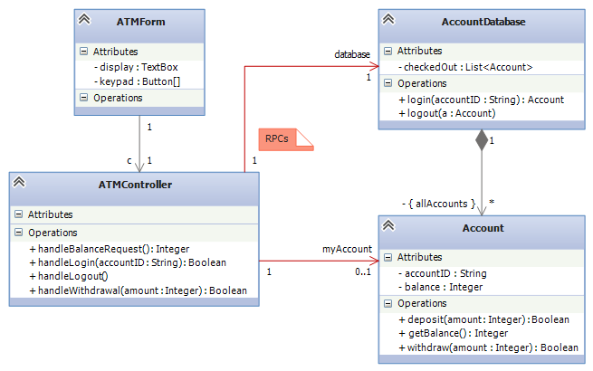
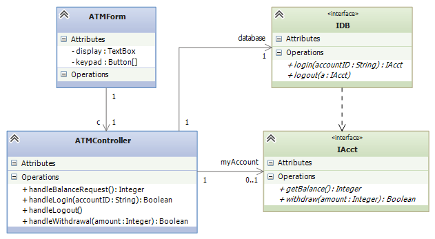
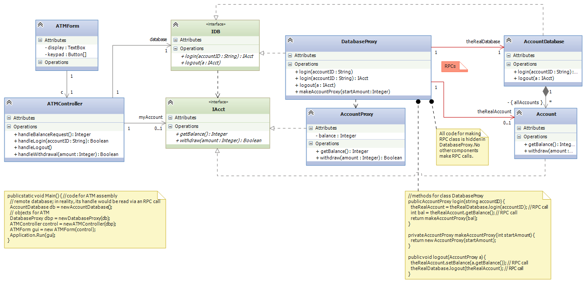
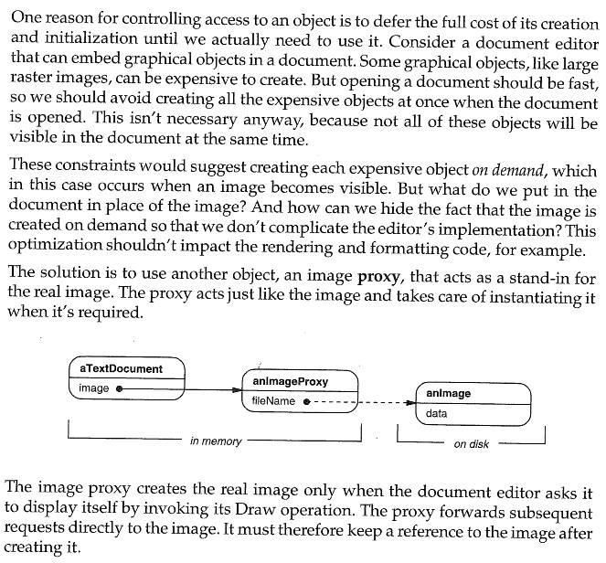
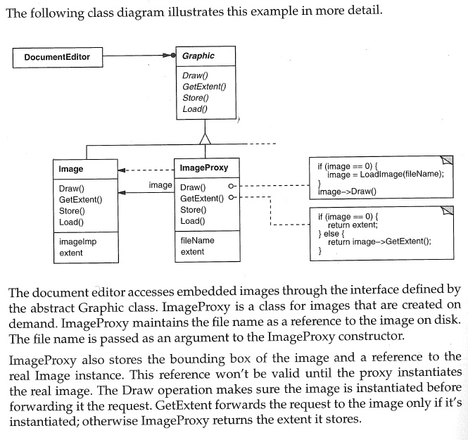

.. raw:: html

    
   
   <big><big><b>
   
Course Notes --- CIS 501: Software Architecture and Design, Fall 2014

.. raw:: html

   </b></big></big>
   

.. _design-patterns-proxies:

Design Patterns II: Proxies
###########################

A "proxy" is a "substitute" or a "stand-in" for the "real item".
Perhaps you have heard of "proxy voting", where a person with a vote authorizes
another person to vote in their place.

Computing systems use proxies, too.

Remote Proxy
************

A *remote proxy* is a local object, a copy, that looks and acts like the "real"
object which is situated at a remote site.
The remote proxy is used to minimize slow, long-distance communications.
It is also used to hide the technical details of making the long-distance
communications.

Consider a banking example, where an ATM and its controller must communicate
with the bank's database to login and do transactions on an account.
Here is a super-simplistic architecture:

The class diagram does not show it, but the ATM is at one physical site and
the database is at another site, far away.
The sequence of actions goes like this:

1. Using the ``ATMForm``, a user tells ``ATMController`` to call
   ``database.login(user's account number)``.
   The call goes to the ``AccountDatabase`` at the remote site.
   *This generates a "remote procedure call" (RPC) --- an internet/phone-line
   transmission* of the method call.
   (The call, which takes multiple lines of code, contains an IP address
   as well as a port number and an encoded handle and the method name and its
   arguments. Some serious coding is needed for making RPCs: see 
   `this web page <http://www.codeproject.com/Articles/4837/Introduction-to-RPC-Part-1>`__ 
   for "simple" examples.)

2. The remote procedure call reaches the ``AccountDatabase``, which finds
   the correct ``Account`` object, adds it to the ``checkedOut`` list, and
   returns the handle.
   *The handle is an address at the database's site, which means that each time
   the ATM assembly uses the handle, it must generate a remote procedure call
   (RPC).*

3. The ``ATMcontroller`` uses the account's handle to query and update
   the account.
   This generates multiple RPCs.

4. When the user finishes, the ``ATMcontroller`` calls
   ``database.logout(account's handle)``, which removes the handle from
   the ``checkedOut`` list.

This implementation generates too many remote procedure calls.
It also fills the ATM's controller with the complex coding for RPCs.
It would be better if the ATM has no RPC code and contacts the database just
once to "load the account into the ATM" and once to "unload and logout".
The ATM would work with a local copy of the account --- its *remote proxy*.

To redesign the system, we first separate the ATM assembly from the database
assembly, using interfaces.
Here is the situation from the ATM's perspective:

We now insert a remote proxy for the ``Account``.
The design will look like the ones used in the CORBA and DCOM (.NET)
client-server architectures.

First, the ATM assembly "thinks" it is talking to the bank's database and
the account retrieved from the database.
But the reality is different: Within each ATM assembly, we add a proxy object,
``DatabaseProxy``, that stands for the remote database, and we add
``class AccountProxy`` that will be used to construct a proxy account object:

(Note: there might be a link from ``AccountProxy`` to ``Account``, so that
the ``Account`` can generate RPCs as needed to its "real" counterpart to do
computation.) Again,

* The ATM assembly is constructed from ``ATMform``, ``ATMcontroller``,
  ``DatabaseProxy``, and ``AccountProxy``.

* The bank's assembly is constructed from ``AccountDatabase`` and ``Account``.

* Interfaces ``IDB`` and ``IAcct`` connect the ATM's "front end" to the
  "back end".

Here is how the system operates:

1. Using the ``ATMForm``, a user tells the ``ATMController`` to call
   ``database.login(user's account id)``.
   The call goes to the ``DatabaseProxy`` object, which is stored locally to
   the ATM.

2. The ``DatabaseProxy`` formulates and sends the remote procedure call,
   ``theRealDatabase.login(user's account id)``.
   IMPORTANT: the RPC call will be much more complex than the cute one-liner,
   ``theRealAccount = theRealDatabase.login(accountID)``,
   stated in the above diagram.

3. The ``AccountDatabase``'s ``login`` method finds the correct ``Account``
   object, adds it to the ``checkedOut`` list, and returns the handle (or,
   it returns the data inside the ``Account`` object, packaged as a string).

4. The ``DatabaseProxy`` uses the information it receives to construct a 
   ``new AccountProxy(...)`` object, and *it returns the handle of the local*
   ``AccountProxy`` *object to the* ``ATMController``.

5. The ``ATMcontroller`` uses the account-proxy's handle to query and update
   the account.
   *The* ``ATMcontroller`` *does not need any code for RPCs*, since the proxy
   is stored locally in the ATM assembly.

6. When the user finishes, the ``ATMcontroller`` calls
   ``database.logout(account handle)``.
   The call goes to the ``DatabaseProxy``, which queries the ``AccountProxy``
   object for its ``balance`` (and maybe additional logging info), which
   it sends via RPC to update the real, remote ``Account`` object.
   The ``DatabaseProxy`` also contacts the bank's ``AccountDatabase`` to
   ``logout``.

7. The ``AccountDatabase`` removes the account's handle from the ``checkedOut``
   list.

Again, the advantages of the remote proxy are

* There are fewer remote procedure calls;

* The code for the RPCs is hidden from the client's "front end".

* The front end communicates with the "back end" as if the back end were locally stored.

* There are standardized interfaces used by both front end and back end to connect together.

* These are the reasons why proxies are used in all modern client-server distributed architectures.

The *Proxy Design Pattern* shown here made possible business commerce on
the internet:
the "back end" is a collection of servers and databases that implement a set of
standardized interfaces.
The "front end" are client computers, situated at remote sites that use
the interfaces.
The proxies are installed with the clients and conduct commerce with the servers.

CORBA is the best known client-server architecture based on the proxy pattern,
but DCOM (embedded in .NET) works this way, too.
Enterprise Java Beans also uses proxies, but for client objects stored as
proxies in the "back end" (server side).

Client-server systems implemented in Java sometimes use *applets* or *servlets*
as proxy objects.
A servlet is an applet (a Java-coded object that can be sent and run on any
Java Virtual Machine) that is constructed by the client and sent by internet to
the server, where the servlet acts as the clients's remote proxy at the server's
site.
This approach is useful for internet commerce: a web client can build
a merchandise order within a servlet object and send the servlet to the vendor's
server, which communicates with the servlet to process and fulfill the order.

Virtual Proxy
*************

Sometimes it is too expensive to construct a complex object or an assembly of
objects all at once, because the computation might use only a small part of
the object/assembly, anyway.
In this case, we construct only the parts we know will be used and insert
"dummy values" --- *virtual proxies* --- for all the other parts.
If the user/client calls on a virtual proxy, then the virtual proxy constructs
the actual object that is needed.
In this way, components are constructed and loaded only when it is certain
they are needed.
In general, a "virtual proxy" is any object that is "partially filled-in" and
whose internal fields get "filled in" bit by bit as the proxy's users/clients
call the proxy's methods and ask for data.

Here is an example where a virtual proxy is used: If you are like most people,
you have thousands of email messages in your mail file.
When you start your mail program, the mailer would take "almost forever" to load
the thousands of email messages with attachments and build the massive header
file that it shows you.

A modern mail program loads as your mail-file-object only the most recent
messages and builds the headers for just them, since these are the messages that
will likely be read by you.
The mail-file-object holds virtual-proxy objects for the headers and messages of
the older mails, which are not so likely to be read.
If you want to read an old message, then your search for the old message
contacts a virtual-proxy, which loads and constructs the older headers and
mails.
(Maybe you have noticed that sometimes your mail program "slows down" when you
suddenly jump into a region of old emails -- that's why.)

Here is a second example: When you load a web page into a browser, the text
loads immediately, but the images do not.
As you scroll through the web page, the images that come into view get
filled in.
That is because the web page is a mix of HTML code for the text and Javascript
code that act as virtual proxies for the images, finding and loading the images
as they are needed (that is, when viewed on the web browser's display).

Here is a nice explanation of the details of the above example, taken from the
*Design Patterns* text by Gamma, et al. (Addison Wesley, 1995), reproduced under
"fair use" laws:

Access Proxy
************

An *access proxy* is used when a system's designer wants to limit the range of
use of an actual object.
The access proxy acts as an "imposter", taking requests and refusing to do some
of them, forwarding the others to the real object.

The standard example of access proxy is the HTTP proxy used by a coffee shop to
limit the web activities of its customers.
That is, when a coffee-shop customer uses the shop's internet to load a web page
with an HTTP address, the request goes first to the access proxy, which checks
if the request is allowable.
(Maybe MMO games, streaming, and gambling sites are not allowed at the coffee
shop.)
An allowable request is forwarded to the shop's HTTP server, which does
the request and returns the web page to the customer.

Summary
*******

Proxies are an important design tool in modern systems:

* A remote proxy is a local object, a copy, that looks and acts like the "real"
  object which is situated at a remote site.
  The remote proxy minimizes slow, long-distance communications and also hides
  the complex coding of remote procedure calls (RPCs) from the client-part,
  the "front end", of the system.

* When it is too expensive to construct an assembly of objects all at once,
  we construct only the objects we know will be used and insert "dummy values"
  --- *virtual proxies* --- for all the others.
  If the computation calls one of the virtual proxies, then the virtual proxy
  constructs the actual object.
  In this way, objects are constructed only when they are needed.

* An access proxy is used when a system's designer wants to limit the range of
  use of an actual object.
  The access proxy acts as an "imposter", taking requests and refusing to do
  some of them, forwarding the others to the real object.

----

.. raw:: html

   
<small><em>
   This note was adapted from David Schmidt's CIS 501, Spring 2014, 
   <a href="http://people.cis.ksu.edu/~schmidt/501s14/Lectures/DP2S.html">Lecture 12</a>
   course note. © Copyright 2014, David Schmidt.
   </em></small>

