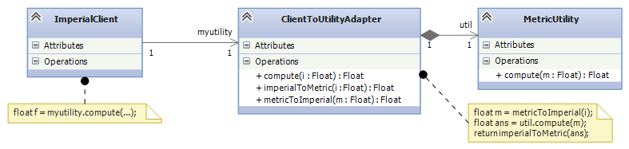
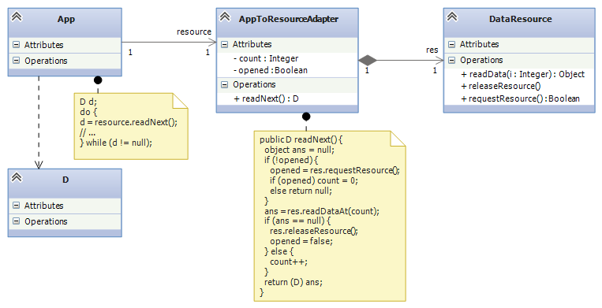
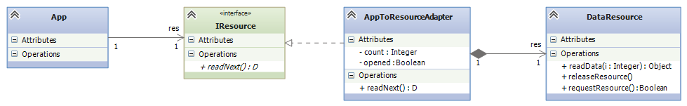
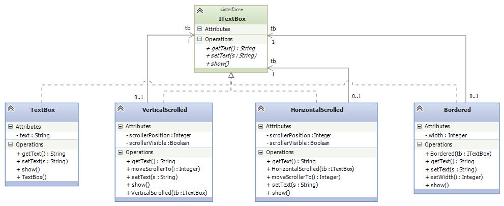
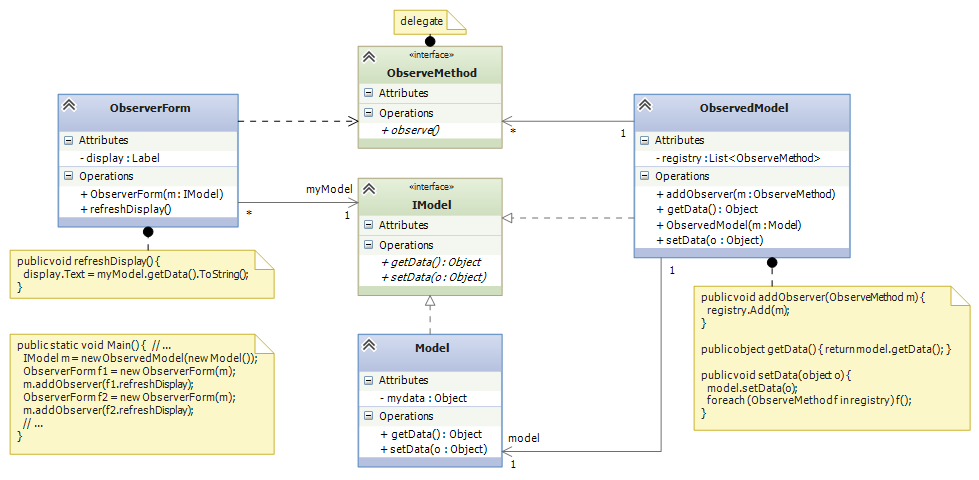
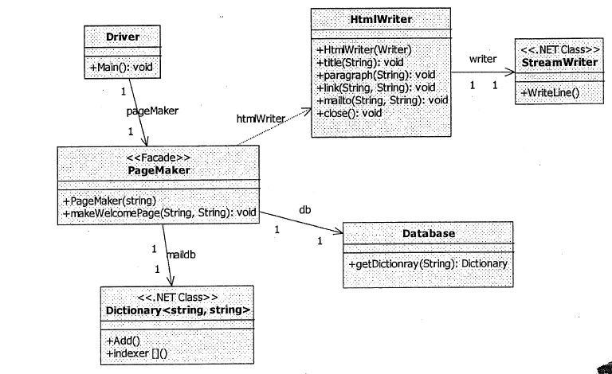
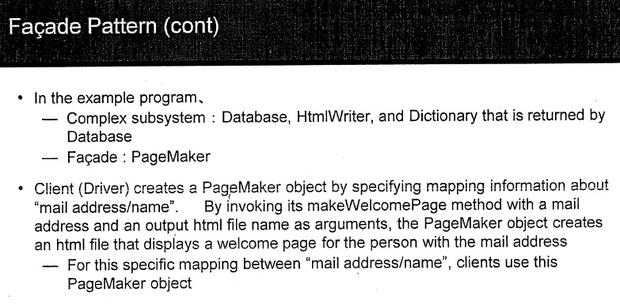

.. raw:: html

    
   
   <big><big><b>
   
Course Notes --- CIS 501: Software Architecture and Design, Fall 2014

.. raw:: html

   </b></big></big>
   

.. _design-patterns-wrappers:

Design Patterns III: Forms of Wrappers
######################################

A *wrapper* is a class that holds a field whose value is a handle to another
object, the "wrapped object".
Users call the wrapper's methods to contact the wrapped object.
Usually, the names of the wrapper's methods are the same as those of the wrapped
object's.
We now study several variants of wrappers.

Adaptor
*******

Software systems are often assembled from components from different libraries,
from different sources, and even from components written in different languages.
For these reasons, the components might not fit together exactly.

For example, you have two components you want to use in your flight control
system --- one computes distances in Metric (meters), but the other uses
Imperial (feet).
(This is not exactly a made-up example --- see 
`the story of the Mars Climate Orbiter <http://en.wikipedia.org/wiki/Mars_Climate_Orbiter>`__
that crashed because of this incompatibility.)

You do not (and maybe you cannot) rewrite either component --- so you place an
*adapter* in the middle:

The ``ClientToUtilityAdaptor`` uses the same public methods as the 
``MetricUtility`` but has added code that converts between Imperial and Metric.

People say that the adapter is a "wrapper" around ``MetricUtility``, because
the handle to the ``MetricUtility`` object is saved in a field in the adaptor.

Adapters can adapt protocols, too.
In the example below, the ``App`` is coded to ``readNext()`` from some resource.
But the coding is naive and neglects to ask permission to use the resource and
to release it at the end of use.
We do not (or cannot) rewrite ``App``, so we use the ``AppToResourceApdater`` to
compute the missing protocol steps:

It is common to insert a new interface between the ``App`` and its adaptor,
just in case the ``App`` is used in the future with yet another incompatible
component:

Decorator
*********

A decorator is a wrapper that adds new methods or fields to an existing class,
while allowing existing methods to remain available.
It is an alternative to the subclass construction. (See the subsection below.)

The standard example where decoration is used (see the *Design Patterns* book or
the `Wikipedia page <http://en.wikipedia.org/wiki/Decorator_pattern>`__)
is in a GUI framework, where there is a bare ``TextBox`` widget that we might
wish to "decorate" with some or all of a vertical scroll bar,
a horizontal scroll bar, or a border.

It is a mess to try to define ``class TextBox`` and then define all possible
subclass combinations of the three decorations.
It is better to have a "kit" of decorations that can be assembled as
"wrappers that wrap up wrappers":

The classes are laid out so that you can start with a plain ``TextBox`` and then
wrap it in some of all of the decorator classes, in whatever order you wish,
e.g.,

.. code-block:: c#

   ITextBox mytextbox = new Bordered(new VerticalScrolled(new TextBox()));
   
A decorator works well whenever there are mix-and-match features that you want
to "patch" onto a class, when you make an object from it.

For example, maybe you want to attach a logging feature to some bank-account
objects, where each transaction is recorded in a log.
It makes no sense to embed the log in the bank account, especially if not
all accounts will be logged or the logging is a temporary feature.
We can define a decorator:

.. code-block:: c#

   interface IAccount {
     int getBalance();
     void deposit(int amt);
     bool withdraw(int amt);
   }

   class BankAccount : IAccount {
     private int balance;
     public BankAccount(int start) { balance = start; }
     public int getBalance() { return balance; }
     public void deposit(int amt) { balance = balance + amt; }
     public bool withdraw(int amt) {
       bool ans = false;
       if (amt <= balance) {
         balance = balance - amt;  ans = true;
       }
       return ans
     }
   }

   class LogDecorator : IAccount {
     private IAccount b;   // the wrapped account object
     private string log = "";
     public Logged(IAccount b) { this.b = b; }
     public int getBalance() { return b.getBalance(); }
     public void deposit(int amt) { 
       log = log + " deposit " + amt.ToString;
       b.deposit(amt);
     }
     public bool withdraw(int amt) { 
       log = log + " withdraw " + amt.ToString;
       return b.withdraw(amt);
     }
   }

Then,

.. code-block:: c#

   IAcccount a = new LogDecorator(new Account(0));
   
constructs the bank account decorated with the logging feature.

How a Decorator Differs from a Subclass
=======================================

New features can also be added to a class by defining a subclass.
Let us redo the logging feature with a subclass:

.. code-block:: c#

   class LogAccount: BankAccount {
     private string log = "";
     public LogAccount(int start) { base(start); }
     public override void deposit(int amt) {
       log = log + " deposit " + amt.ToString;
       base.deposit(amt);   // "base" means the superclass, here  BankAccount
     }
     public override bool withdraw(int amt) {
       log = log + " withdraw " + amt.ToString;
       base.withdraw(amt);
     }
   }

Then,

.. code-block:: c#

   LogAccount a = new LogAccount(0);
   
The advantage to the subclass is that we do not have to recode ``getBalance`` in
``LogAccount`` --- the call "passes through" to the superclass.
The disadvantage is that ``LogAccount`` is fixed to extend only ``BankAccount``.
If we want logging for other variations of ``BankAccount``, we must
copy-and-paste the code for ``LogAccount`` into more subclasses.
Also, we cannot mix-and-match the logging feature with other features,
because the subclass definition has "locked" the logging feature onto a "bare"
bank account.

It is easy to make errors using subclasses.
For example, if we had mistakenly coded ``deposit`` like this:

.. code-block:: c#

   public override void deposit(int amt) {
     log = log + " deposit " + amt.ToString;
     deposit(amt);   // this is also the same as,  this.deposit(amt);
   }

the call to ``deposit`` would restart itself forever, never calling ``deposit``
in ``BankAccount``!

Observers and Wrappers
**********************

In an earlier lecture, we saw several variations of the Model-View-Controller
software architecture, which is useful for single-user systems where there are
multiple forms (Views) that insert and display data in an internal database
(the Model).

The key idea was, to improve coupling, a list of delegates --- a "registry" ---
holds the methods to call when there is a Model update.
The called methods contact the output-view forms that must repaint to show the
updated Model's information.

The output-view forms are *observers* of the Model.
The benefit of using a registry of observers is that the Model never needs to
know the names or even the classes of the forms that are observing it.
Also, new observers can be added to the registry while the system is running,
and observers can be removed while the system is running.
The Model is completely unaffected.

In the earlier lecture, we saw how the researchers at Xerox PARC developed
the Observer Design Pattern, where the Model is attached to an abstract class
that holds the registry of observer methods.

But yet another way to implement the registry of observers is with a wrapper
class that "wraps" around the model, like this:

The small advantage to this design is that whenever there is an update to the
``Model``, the ``ObservedModel`` receives the call, does the update, and calls
all the observers (as they should be!) --- there is no need for an explict call,
say, by a controller, to a ``notify()`` method.
Wrappers work well for embedding operations that "should be done automatically".
(On the negative side, notice that the wrapper ``ObservedModel`` must have
the same-named methods as ``Model`` so that it implements interface ``IModel``.)

Facade
******

When you extract and use components from a library, you must write code to
connect them and use them.
The resulting assembly might be a mess because there is no clear "entry point"
into the assembly.
When you write an entry class that has methods for using the assembly,
you have designed a *facade*.

A facade is a kind of "wrapper around an entire assembly", giving you useful
methods for working with the assembly.

In his CIS501 notes, Dr. Mizuno gives a good example of a facade:
There is some web-client assembly (the "Driver", seen below) that must connect
and login to a database and then use some html-page-making software to embed
the database info into a web page for display.
The controller for the web client will be a complicated mess, calling methods
from the database and the page-making software.
It would be better to write an entry class, a *facade*, ``class PageMaker``,
that holds an "entry method", ``makeWelcomePage``, that does the complicated
login and html-page building:

Here is Dr. Mizuno's explanation:

Summary
*******

A *wrapper* is a class that holds a field whose value is a handle to
another object, the "wrapped object".
Users call the wrapper's methods to contact the wrapped object.

Here are some important variants:

1. An *adapter* is a wrapper that lets a client object connect to (call methods)
   of another, wrappred object, even though the names and arguments of
   the client's method calls do not exactly match the names and parameters of
   the wrapped object's methods.
   The adapter holds conversion code that converts/translates the client's calls
   into correct calls of the wrapped objet.

2. A *decorator* is a wrapper that adds new methods or fields to
   an existing class, while allowing existing methods to remain available.
   A decorator works well whenever there are mix-and-match features that
   you want to "patch" onto a class when you make an object from it.

   A decorator can be used to hold a registry (list) of "observers" of
   a data structure.
   The data structure is wrapped by the decorator.
   When the data structure is updated, all the observers in the registry are
   called.
   This is the *observer design pattern*.

3. A *facade* is an "entry class" into an assembly of classes that are meant to
   work together.
   The facade defines methods that clients call to activate the assembly and
   make it do useful work.

----

.. raw:: html

   
<small><em>
   This note was adapted from David Schmidt's CIS 501, Spring 2014, 
   <a href="http://people.cis.ksu.edu/~schmidt/501s14/Lectures/DP3S.html">Lecture 13</a>
   course note. © Copyright 2014, David Schmidt.
   </em></small>

