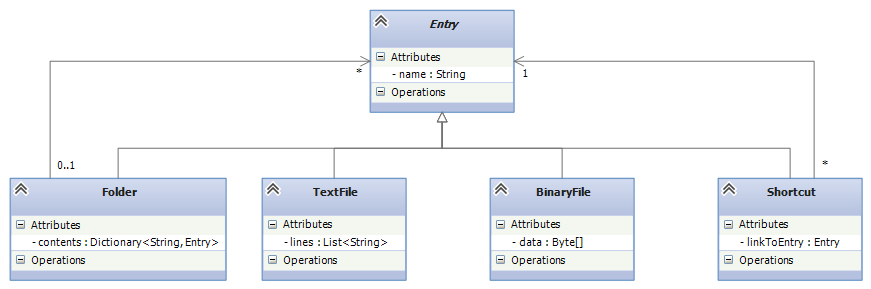

.. raw:: html

    
   
   <big><big><b>
   
Course Notes --- CIS 501: Software Architecture and Design, Fall 2014

.. raw:: html

   </b></big></big>
   

.. _design-patterns-layered-dt:

Design Patterns IV: Patterns for Layered Data Types
###################################################

If you are a C-programmer, your world consists of ints, pointers
(storage addresses), and linear arrays.
As a convenience, the C-compiler lets you define matrices and structs, but
these are really just linear arrays with a complex layout.
You must learn modeling tricks for all other types of data.

If you are a script programmer (Javascript, Python, Ruby, ...), your world is
that of ints, strings, tuples, lists (arrays that grow and shrink), and
dictionaries (hash tables whose keys can be "nonmutable" data values).
You must learn modeling tricks for all other types of data.

If you are a Java/C# programmer, your world is C but with a class construction,
which is nothing more than a struct that holds both variable declarations
(fields) and methods.
As a convenience, you are given libraries with complex names and methods that
implement lists and dictionaries.
You must learn modeling tricks for all other types of data.

Real-life data rarely matches the data types given to you by your language.
Real data tends to be grouped in "layers" or "levels" with possible "horizontal"
or "cross-level" references (linkages).
It is critical that a C#/Java programmer learn to model layered data types.
There are two relevant design patterns.

Composite Design Pattern
************************

Here is an important example of a layered data type:
your computer's file system.
A file system consists of a start, "root" folder.
Inside the folder are "entries": textfiles, binary files, links
(shortcuts/pathnames) to entries, and more folders.
The inner folders hold more of the same, more entries --- your computer's file
system is a layered data type, where each entry defines a layer/level of data:

    A *File system* is a *Folder*, which is a form of *Entry*, where

    An *Entry* is either:
    
    * a *Textfile*, which holds a sequence of chars

    * a *Binaryfile*, which holds a sequence of ints

    * a *Shortcut*, which is a handle or pathname to an Entry

    * or a *Folder*, which holds a sequence of zero or more Entries

We can write this composite definition (also known by mathematicians as
an inductive definition) as a set of "data type equations":

.. productionlist::
   Entry      : `Textfile` | `Binaryfile` | `Shortcut` | `Folder`
   Textfile   : List<char>
   Binaryfile : List<int>
   Shortcut   : pointerTo(`Entry`)
   Folder     : Dictionary<string, `Entry`>
              :
   FileSystem : `Folder`

These equations define a data type in many functional programming languages
(Standard ML, Haskell, OCAML, Scala's pattern language), but we must manually
model the composite definition in an object language.

The *Composite Design Pattern* is the scheme we use to convert a layered data
type definition into class-based code.
Here is the class diagram that defines "type" ``Entry``.
We use an *abstract class* (incomplete class) to name ``Entry``.

Notice the relationship between the equations and the class diagram.
Notice also the "backwards" arc from ``Folder`` to ``Entry``, stating that
"an Entry can be a Folder which itself holds Entries."

Here is code corresponding to the class diagram.
The composite type's name is coded as an abstract class (an "unfinished class")
that holds an Entry's ``name``.
The rest of an entry is filled in by one of the options that extend/finish
the abstract class:

.. code-block:: c#

   // the base name of the composite type:
   public abstract class Entry {
     protected string name;  // the entry's name; accessible to the subclass code

     // get and set the value of name:
     public string Name {
       get { return name; }
       set { name = value; }
     }
   }

   // models a text file as a sequence (list) of strings
   public class TextFile: Entry {
     private List<string> lines;

     public TextFile(string name) {
       base.name = name;  // stores the name in the class Entry part of this object
       lines = new List<string>();  // file is empty at the start
     }

     // methods to add a line and to return all the lines of the file:
     public void addLine(string s) { lines.Add(s); }
     public List<string> Lines { get { return lines; } }
   }

   // models a link (shortcut) to an Entry not in the present folder/level
   public class Shortcut: Entry {
     public readonly Entry link;

     public Shortcut(string name, Entry link) {
       base.name = name;
       this.link = link;
     }
   }

   // models a folder as a directory of Entries, indexed by their names:
   public class Folder : Entry {
     private Dictionary<string, Entry> directory;

     public Folder(string name) {
       base.name = name;  // save name in class Entry part of this object
       directory = new Dictionary<string, Entry>();  // initially, folder is empty
     }

     // returns the Entry with  name.  If name is bogus, returns null.
     public Entry find(string name) {
       Entry ans = null;
       if (directory.ContainsKey(name)) { ans = directory[name]; }
       return ans;
     }

     // adds a new Entry, e, to this folder
     public void add(Entry e) { 
       if (!directory.ContainsKey(e.Name)) {
         directory[e.Name] = e;
       }
     }

     // returns a list of all the Entry objects saved in this folder
     public List<Entry> getListing() {
       List<Entry> ans = new List<Entry>();
       foreach (var pair in directory) { ans.Add(pair.Value); }
       return ans;
     }
   }

Say that a file system consists of a ``Root`` folder that holds textfile, 
``t.txt``, and folders ``F`` and ``H``.
Folder ``F`` holds binary file, ``b.exe``, and folder ``G``, which itself holds
folder ``K`` and textfile ``u.txt``.
Folder ``K`` is empty.
Finally, folder ``H`` holds a shortcut (link) to textfile ``u.txt``.
The objects constructed from the above classes to implement the file system
would look like this:

.. image:: compob.jpg

Processing Values from a Layered Data Type
==========================================

A compound object that is constructed from a composite data type is organized in
levels or layers.
In the file-system example, each ``Folder`` is a "level" and a nested ``Folder``
is an inner "level."

Say that we must print the names of all the entries in the file system ---
this is a standard traversal activity. There are two ways to do this.

Explicit recursion
------------------

The classic solution is to define a single tree-traversal method that "opens up"
the levels of the file-system object that it traverses, using explicit recursive
calls to open the inner levels.
The code below might be placed in ``class Entry``:

.. code-block:: c#

   // returns a (long) string that lists the name of the current entry
   //   and the names of all the Entries within it, if any.
   // In the code, note that  "this"  refers to the object being analyzed.
   public string contentsOf() { 
     string ans = this.Name;
     if (this is TextFile) { // was  this  object constructed from class TextFile? 
       ans = ans + " is a text file\r\n";
     } else if (this is Shortcut) {
       ans = ans + " is a shortcut\r\n";
     } else if (this is Folder) {
       ans = ans + " is a folder containing:\r\n";
       List<Entry> contents = ((Folder)this).getListing(); // get all entries in the folder
       foreach (Entry item in contents) {  // get contents of all the entries:
         ans = ans + item.contentsOf();    // RECURSIVE CALL IS HERE
       }
     }
     return ans;
   }

So, if the file-system object is ``fileSystem``, the call, 
``fileSystem.contents()`` will open up the levels of ``fileSystem`` and print
all the names therein.

Implicit recursion
------------------

Method ``contentsOf`` seen above contains three different cases of ``Entry`` to
analyze.
But if we add more subclasses that extend abstract ``class Entry`` (say, we add
``class BinaryFile : Entry``), then we must patch the code for ``contentsOf``.
We might forget to do this!

Here is a better style for coding ``contentsOf`` in the composite structure:
We divide the cases and embed each case in its specific class of ``Entry``,
like this:

.. code-block:: c#

   // the base name of the composite type:
   public abstract class Entry {
     protected string name;  // the entry's name; accessible to the subclass code

     // get and set the value of name:
     public string Name {
       get { return name; }
       set { name = value; }
     }
    
     // IMPORTANT: The keyword, "abstract", below states that code must be
     // provided by the class that implements abstract class  Entry:
     //    Returns a string that lists the name of the current entry 
     //    and the names of all the Entries within it, if any.
     public abstract string contentsOf();    // SEE KEYWORD, "abstract"
   }

   // models a text file as a sequence (list) of strings
   public class TextFile: Entry {
     private List<string> lines;

     public TextFile(string name) {
       base.name = name;  // stores the name in the class Entry part of this object
       lines = new List<string>();  // file is empty at the start
     }

     public string contentsOf() {
       return this.name + " is a text file\r\n";
     }      
   }

   // models a link (shortcut) to an Entry not in the present folder/level
   public class Shortcut: Entry {
     public readonly Entry link;

     public Shortcut(string name, Entry link) {
       base.name = name;
       this.link = link;
     }
    
     public string contentsOf() {
       return this.name + " is a shortcut\r\n";
     }     
   }

   // models a folder as a directory of Entries, indexed by their names:
   public class Folder : Entry {
     private Dictionary<string, Entry> directory;

     public Folder(string name) {
       base.name = name;  // save name in class Entry part of this object
       directory = new Dictionary<string, Entry>();  // initially, folder is empty
     }

     // returns a list of all the Entry objects saved in this folder
     public List<Entry> getListing() {
       List<Entry> ans = new List<Entry>();
       foreach (var pair in directory) { ans.Add(pair.Value); }
       return ans;
     }
    
     public string contentsOf() {
       string ans = this.name + " is a folder containing:\r\n";
       List<Entry> contents = ((Folder)this).getListing();
       foreach (Entry item in contents) {
         ans = ans + item.contentsOf();  // RECURSIVE CALL IS HERE
       }
       return ans;
     }  
   }
   
IMPORTANT: the header line, ``public abstract string contentsOf()``, in 
``class Entry`` declares that each subclass must have an appropriate 
``contentsOf`` method.
When we call ``filesystem.contentsOf()``, the code for ``contentsOf`` in 
``class Folder`` is executed first, and it calls the appropriate ``contentsOf``
methods for the folder's subentries.
The execution now proceeds in the same order as with the explicit recursion.

More Examples of Layered Types
==============================

Game board
----------

A Mario-Brother-style "adventure" game lets a player explore levels of
a universe.
The "game board" for an adventure game is usually a compound object from
a layered data type.
For example, an adventure game that explores "Areas" might use this type of
game board:

An *Area* is either:

* a *Room* that holds a ``Prize``, a ``Bomb``, and (a door to) another ``Area``;

* a *Passageway* that holds one or more (doors to) other ``Area`` s;

* *Nirvana*, which is the winning area;

* the *Black* Hole, which is the losing area.

The corresponding composite design looks like this:

.. image:: comp2.png

Game boards are constructed to have data type, ``Area``.
If you look at the code and the object diagram for the file system example,
you can visualize a layered game-board layout for an adventure game based on
exploring ``Areas``.

Spelling tree
-------------

Most word processors for cell phones have "word completion" software, that is,
when you type the first few letters of a word, the software guesses what you are
typing based on your previous typing behaviors and provides suggestions to you
for completing your word.
The software extracts its guesses from a layered data structure that it builds
and maintains, a spelling tree.

Here is a possible definition of a spelling tree for word completion:

A *path* consists of a string of chars (the "word typed so far"),
an int count of the number of times this path has been encountered as
a completed word, and a collection of paths to suffixes of the word typed so far.
This layered data type can be modelled with just one class, which holds handles
to zero of more inner levels of its own class. Here is the code for 
``class Path``:

.. code-block:: c#

   // models a partial/complete word, entered as a sequence ("path") of chars
   public class Path {
    private string word; // the sequence of chars, e.g., "cat"
    private int count;   // how many times this sequence has been used as a completed word 

    private Dictionary<char, Path> suffixes;  // extensions of this word, e.g., "cats" (indexed by 's') or "cattle" (indexed by 't')

    public Path(string wordSoFar) {
      word = wordSoFar;  count = 0;  
      suffixes = new Dictionary<char, Path>();
    }

    // "get" methods:
    public string getWord() { return word; }
    public int getCount() { return count; }

    // notify this Path that its word is complete and used in the user's document
    public void finishedWord() { count++; }

    // add another letter, c,  to the word being typed and return path of  word+c
    public Path addLetter(char c) {
      Path ans = null;
      if (suffixes.Contains(c)) {
        ans = suffixes[c];
      } else {
        ans  = new Path(word + c);
        suffixes[c] = ans;
      }
      return ans;
    }

    // returns handle to path for this  word+c. If none exists, returns null
    public Path findNextLetter(char c) {
      Path ans = null;
      if (suffixes.Contains(c)) { ans = suffixes[c]; }
      return ans;
    }
  }

Here is how we add words to the spelling tree:

.. code-block:: c#

   Path spellingTree = new Path("");

   string inputText = "cats cannot catch cold quickly";
   string[] words = inputText.split(' ');  // divide text into its 5 words
   foreach (string w in words) {  // add  w  to  spellingTree:
     Path path = spellingTree;
     foreach(char c in w) { 
       path = path.addLetter(c); 
     }
     path.finishedWord();  // increment count for  w
   }
   
This method queries spellingTree for word counts, e.g., 
``spellingTree.countOf("cats")``:

.. code-block:: c#

   public int countOf(string word) {
     Path p = this;  // start counting at the root of this tree
     foreach (char c in word) { // search tree for word, one char at a time:
       p = p.findNextLetter();
       if (p == null) { return 0; }  // word isn't found
     }
     // else, we found  word  in the tree, so
     return p.countOf();
   }

Interpreter pattern
*******************

When we use a GUI to communicate with a software system, we are using a kind of
"point and nudge" language, like humans use when they do not want to speak words
to one another.

More intelligent communication can be made with words than with
"point and nudge", and sophisticated software systems use word-based
"command languages" for input.
Examples of command languages are ``bash``, for talking to an operating system;
``SQL DML``, for asking queries to a database; and ``Javascript``, for talking
to a web browser.

Languages based on words have internal phrase structure, which is naturally
expressed by a composite data type.
(E.g., "a sentence consists of a subject phrase and a predicate phrase, where
the subject phrase has a noun and a modifier phrase and the predicate phrase
has a verb, a modifier phrase, and optional direct-object and indirect-object
phrases, ...".)

We saw in the previous section how a method uses self-calls (recursions) to open
the inner levels of an object.
This is again the case for language processing: an *interpreter* is a method
that calculates the meaning/actions of a command by opening the command with
recursive calls.

Interpreters are so important to modern-day programming that the name,
"interpreter design pattern", was coined to emphasize this implementation
technique.

Example: The Command Language of Arithmetic
===========================================

In the 1950s, Noam Chomsky realized that the syntax of a sentence can be
represented by a tree, and the rules for building syntactically correct
sentences can be written as an equational, inductive definition.
Chomsky called the definition a *grammar*.
(John Backus and Peter Naur independently discovered the same concept, and
for this reason, a grammar is sometimes called 
*BNF (Backus-Naur form) notation*.)

A grammar is a set of equations (*rules*), where each equation defines a set of
phrases (strings of words).

Say we wish to define precisely how to write arithmetic expressions, which
consist of numerals composed with addition and subtraction operators.
Here are the equations (rules) that define the syntax of arithmetic expressions:

.. productionlist::
   EXPRESSION : `NUMERAL` |  ( `EXPRESSION` `OPERATOR` `EXPRESSION` )
   OPERATOR   : + | -
              :
   NUMERAL    : a sequence of digits from the set { 0, 1, 2, ..., 9 }

The words in upper-case letters (*nonterminals*) name phrase and word forms: 
an ``EXPRESSION`` phrase consists of *either* a ``NUMERAL`` word *or*
a left paren followed by another (smaller) ``EXPRESSION`` phrase followed by
an ``OPERATOR`` word followed by another (smaller) ``EXPRESSION`` phrase
followed by a right paren. (The vertical bar means "or".)

If the third equation is too informal for you, we can replace it with these two:

.. productionlist::
   NUMERAL : `DIGIT` | `DIGIT` `NUMERAL`
   DIGIT   :  0 | 1 | 2 | 3 | 4 | 5 | 6 | 7 | 8 | 9
    
but usually the spelling of individual words is stated informally, like we did
originally.
Using the rules, we can verify that this sequence of symbols is a legal 
``EXPRESSION`` phrase::

   (14 - (3 + 2))

Here is the explanation, stated in words:

``14`` is a NUMERAL (as are ``3`` and ``2``)
all NUMERALs are legal EXPRESSION phrases, so ``14`` is an EXPRESSION phrase, as
are ``3`` and ``2``.
Since ``3`` and ``2`` are EXPRESSION phrases, then so is ``(3 + 2)`` because 
``+`` is an OPERATOR.
``(14 - (3 + 2))`` is an EXPRESSION, because ``14`` and ``(3 + 2)`` are 
EXPRESSIONs, and ``-`` is an OPERATOR.
There is a compact representation of an arithmetic sentence, as an 
*operator tree*. 
Here is the operator tree for ``(4 - (3 + 2))``::

           -
         /   \
        4     +
             / \
            3   2

An operator tree places the "operator" or "verb" at the top of each "phrase"
(subtree).

An operator tree for arithmetic has two forms, which we can define precisely
with its own BNF rule, like this::

   TREE    ::=  NUMERAL   |     OP
                               /  \
                            TREE  TREE
   OP      ::=  +  |  -
   NUMERAL ::=  a string of digits

That is, every operator tree is either just a single numeral or a tree holding
an operator symbol and two subtrees.
This is clearly a composite type whose code looks like this:

.. code-block:: c#

   public abstract class Expression { }

   public class NumeralTree : Expression {
     public readonly string theNumeral;
     // ...
   }

   public class ExpressionTree : Expression {
     public readonly string operator;  // should be "+" or "-"
     public readonly Expression left;
     public readonly Expression right;
     // ...
   }

A parser reads a string like ``(14 - (2 + 3))`` and generates this operator tree:

.. code-block:: c#

   Expression tree = new ExpressionTree("-",
                                        new NumeralTree("14"),
                                        new ExpressionTree("+",
                                                           new NumeralTree("2"),
                                                           new NumeralTree("3")));

When a compiler or interpreter processes a computer program, it first builds
the program's operator tree.
Then, it calculates the meaning --- the semantics --- of the tree.

Here is the interpreter for the arithmetic language.
It computes on the operator tree representation of the arithmetic program:

.. code-block:: c#

   public int interpretTree(Expression t) {
     int meaning = -1;
     if (t is Numeral) {
       meaning = Convert.ToInt32(t.theNumeral);
     } else if (t is ExpressionTree) {
       int leftmeaning = interpretTree(t.left);
       int rightmeaning = interpretTree(t.right);
       if (t.operator == "+") {
         meaning = leftmeaning + rightmeaning;
       } else if (t.operator == "-") {
         meaning =  leftmeaning + rightmeaning;
       }
     }
     return meaning;
   }

*The function's recursions match the recursions in the grammar rule/composite
data type that defines the set of operator trees.*
The recursion computes the numerical meanings of the subtrees and combines them
to get the meaning of the complete tree.

----

.. raw:: html

   
<small><em>
   This note was adapted from David Schmidt's CIS 501, Spring 2014, 
   <a href="http://people.cis.ksu.edu/~schmidt/501s14/Lectures/DP4S.html">Lecture 14</a>
   course note. © Copyright 2014, David Schmidt.
   </em></small>

